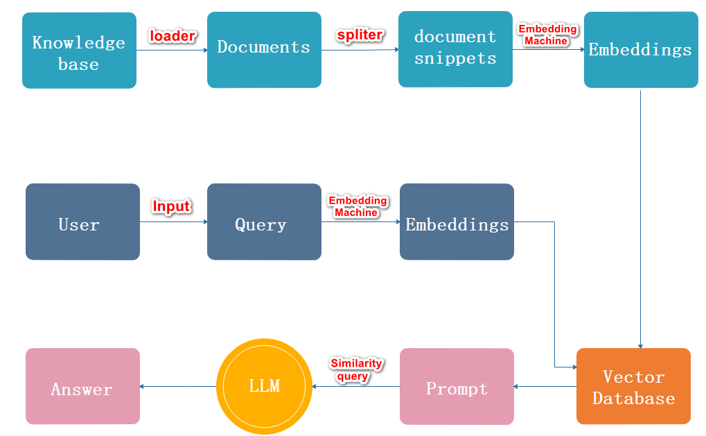
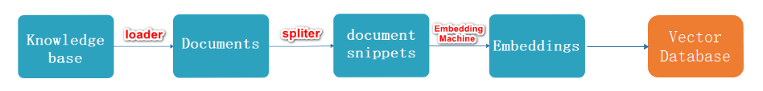
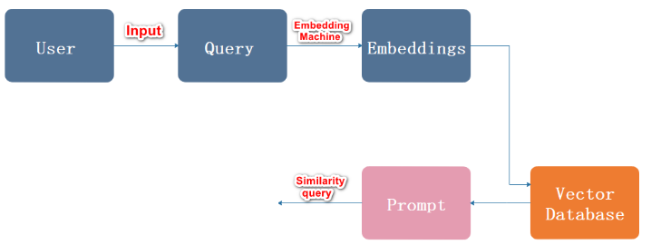
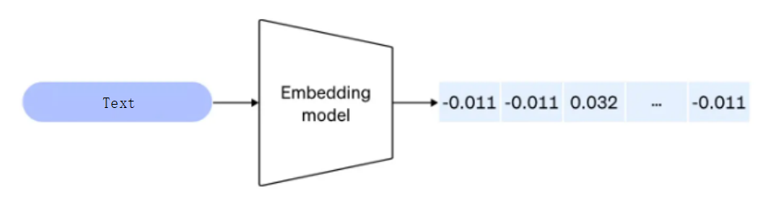

# 大模型RAG的原理及应用

## 1. RAG系统与Embedding

### 1.1 LLM的局限性

- LLM的知识不是实时的，不具备知识更新
- LLM可能不知道你私有的领域/业务知识
- LLM有时会在回答中生成看似合理但实际上是错误的信息

### 1.2 为什么会用到RAG

- 提高准确性: 通过检索相关的信息，RAG可以提高生成文本的准确性。

- 减少训练成本：与需要大量数据来训练的大型生成模型相比，RAG可以通过检索机制来减少所需的训练数据量，从而降低训练成本。

- 适应性强：RAG模型可以适应新的或不断变化的数据。由于它们能够检索最新的信息，因此在新数据和事件出现时，它们能够快速适应并生成相关的文本。


### 1.3 RAG概念

- RAG（Retrieval Augmented Generation）顾名思义，通过**检索**的方法来增强**生成模型**的能力
  - **检索(Retrieval )**: 根据用户请求从外部知识源检索相关上下文。
  - **增强(Augment)**: 用户查询和检索到的附加上下文被填充到提示模板中。
  - **生成(Generate)**: 检索增强提示被馈送到 LLM。
- 它是一个为大模型提供外部知识源的概念，这使它们能够生成准确且符合上下文的答案，同时能够减少模型幻觉。

## 2. RAG系统工作流程图解




- 流程描述
  - 加载，读取文档
  - 文档分割
  - 文档向量化
  - 用户输入内容
  - 内容向量化
  - 文本向量中匹配出与问句向量相似的`top_k`个
  - 匹配出的文本作为上下文和问题一起添加到`prompt`中
  - 提交给`LLM`生成答案
  
- Indexing过程

  

- Retrieval过程

  

## 3. 向量检索

### 3.1 检索的方式有那些?

- 关键字搜索：通过用户输入的关键字来查找文本数据。
- 语义搜索：它的目标是理解用户查询的真实意图，不仅考虑关键词的匹配，还考虑词汇之间的语义（文字，语音，语调...）关系，以提供更准确的搜索结果。

### 3.2 向量与Embeddings的定义

- 在数学中，向量（也称为欧几里得向量、几何向量），指具有大小和方向的量。
- 它可以形象化地表示为带箭头的线段。
- 箭头所指：代表向量的方向；线段长度：代表向量的大小。
  - 将文本转成一组浮点数：每个下标 i，对应一个维度
  - 整个数组对应一个 n 维空间的一个点，即**文本向量**又叫 Embeddings
  - 向量之间可以计算距离，距离远近对应**语义相似度**大小

 


- 如上图所示
  - 把文本转换成数组的过程叫做向量化
  - 向量之间的距离对应向量的语义相似度


> 列表推导式

```python
input_list = [1, 2, 3, 4, 5]
# squared_numbers = [num ** 2 for num in input_list]
squared_numbers = [num + 2 for num in input_list]
print(squared_numbers)
```

> 示例

```python
from openai import OpenAI
client = OpenAI()

# 参数一 => input 你要输入的数据
# 参数二 => model 模型
res = client.embeddings.create(input="机器学习是人工智能的一个分支。", model='text-embedding-3-large').data

print(res)
print("-----------")
print([x.embedding for x in res])
# 向量的维度
print(len([x.embedding for x in res][0]))
```

> 示例

```python
from openai import OpenAI
client = OpenAI()

#  参数一 => texts 是一个包含要获取嵌入表示的文本的列表，
#  参数二 => model 则是用来指定要使用的模型的名称
def get_embeddings(texts, model="text-embedding-3-large"):
    # 创建一个嵌入向量。结果存储在data中。
    # .data就是返回的数组
    data = client.embeddings.create(input=texts, model=model).data
    # 列表推导式
    return [x.embedding for x in data]


if __name__ == '__main__':
    test_query = ["机器学习是人工智能的一个分支。"]
    vec = get_embeddings(test_query)
    print("-----------------------")
    #  "机器学习是人工智能的一个分支。" 文本嵌入表示的列表。 得到的是一个二维数组
    print(vec)
    #  "机器学习是人工智能的一个分支。" 文本的嵌入表示。
    print(vec[0])
    #  "机器学习是人工智能的一个分支。" 文本的嵌入表示的维度。3072
    print(len(vec[0]))
```

### 3.3 向量间的相似度计算 

- 前提: 不考虑长度,不考虑维度

- 欧式距离 => 权重值设置为1,两个点之间越接近0的(就是两个点越相近)

- COS 余弦 => 一个向量空间中两个向量夹角间的余弦值作为衡量两个个体之间差异的大小，余弦值接近1，夹角趋于0，表明两个向量越相似，余弦值接近于0，夹角趋于90度，表明两个向量越不相似,比如:

  - cos(0°)=1
  - cos⁡(90°)=0

  


> 示例

```python
import os
from openai import OpenAI
import numpy as np
from numpy import dot
from numpy.linalg import norm
api_key = os.getenv("OPENAI_API_KEY")
client = OpenAI()

def cos_sim(a, b):
    '''余弦距离 -- 越大越相似'''
    return dot(a, b)/(norm(a)*norm(b))

def l2(a, b):
    '''欧式距离 -- 越小越相似'''
    x = np.asarray(a)-np.asarray(b)
    return norm(x)

def get_embeddings(texts, model="text-embedding-3-large"):
    #  texts 是一个包含要获取嵌入表示的文本的列表，
    #  model 则是用来指定要使用的模型的名称
    #  生成文本的嵌入表示。结果存储在data中。
    data = client.embeddings.create(input=texts, model=model).data
    # print(data)
    # 返回了一个包含所有嵌入表示的列表
    return [x.embedding for x in data]

# 且能支持跨语言
query = "国际争端"
documents = [
    "美苏冷战，全球争霸，影响深远，历史重大对峙。",
    "土耳其、芬兰、瑞典与北约代表将继续就瑞典“入约”问题进行谈判",
    "日本岐阜市陆上自卫队射击场内发生枪击事件 3人受伤",
    "国家游泳中心（水立方）：恢复游泳、嬉水乐园等水上项目运营",
    "我国首次在空间站开展舱外辐射生物学暴露实验",
]

# 对query进行词嵌入
query_vec = get_embeddings([query])[0]
# 对文档进行词嵌入
doc_vecs = get_embeddings(documents)

# 使用余弦值策略相似度
# cos0 = 1,cos90 = 0  =>  夹角越大,相似度越高,夹角越小,相似度越低
# print(cos_sim(query_vec, query_vec))

# for vec in doc_vecs:
#     print(cos_sim(query_vec, vec))

# 使用欧式距离衡量相似度
# 范围 0 ~ ∞ => 距离越小，相似度越高；距离越大，相似度越低。
print(l2(query_vec, query_vec))

for vec in doc_vecs:
    print(l2(query_vec, vec))
```

### 3.4 常见向量数据库

- 主流的向量数据库

  

  - FAISS: Meta 开源的向量检索引擎 https://github.com/facebookresearch/faiss
  - Pinecone: 商用向量数据库，只有云服务 https://www.pinecone.io/
  - Milvus: 开源向量数据库，同时有云服务 https://milvus.io/
  - Weaviate: 开源向量数据库，同时有云服务 https://weaviate.io/
  - Qdrant: 开源向量数据库，同时有云服务 https://qdrant.tech/
  - PGVector: Postgres 的开源向量检索引擎 https://github.com/pgvector/pgvector
  - RediSearch: Redis 的开源向量检索引擎 https://github.com/RediSearch/RediSearch
  - ElasticSearch 也支持向量检索 https://www.elastic.co/enterprise-search/vector-search

### 3.5 相关语法分析

> 分析代码片段1

```Python
# enumerate 函数用于遍历一个可迭代对象并同时获得索引
def list_with_index(my_list):
    # 遍历 my_list 并同时获取索引 i 和元素 item
    for i, item in enumerate(my_list):
        print(f'Index: {i}, Item: {item}')

if __name__ == '__main__':
    list_with_index(['a', 'b', 'c'])
    # 输出：
    # Index: 0, Item: a
    # Index: 1, Item: b
    # Index: 2, Item: c
```

> 分析代码片段2

```Python
# 如果 num 不在 allowed_numbers 中，则跳过该循环的当前迭代
def filter_numbers(numbers, allowed_numbers):
    for num in numbers:
        if num not in allowed_numbers:
            continue  # 跳过当前循环
        print(num)
if __name__ == '__main__':
    filter_numbers([1, 2, 3, 4, 5], [2, 4])
    # 输出：
    # 2
    # 4
```

> 分析代码片段3

```Python
def check_type(obj):
    # 检查obj是否为int类型
    if isinstance(obj, int):
        print("这是一个整数")
    # 检查obj是否为str类型
    elif isinstance(obj, str):
        print("这是一个字符串")
    else:
        print("未知类型")
if __name__ == '__main__':
    # 测试不同类型的变量
    check_type(123)      # 输出：这是一个整数
    check_type("hello")  # 输出：这是一个字符串
    check_type([1, 2])   # 输出：未知类型
```

> 分析代码片段4

```python
text = "-example-text-"
# 除字符串两端的指定字符
cleaned_text = text.strip('-')
print(cleaned_text)  # 输出 "example-text"
```

> 分析代码片段5

```python
# 初始化变量
buffer = ''  # 用于暂时存储合并的文本。初始时为空字符串。
# 定义一些示例文本行
text_lines = [
    "111,",
    "222-",
    "333。"
]
# 处理每一行文本
for text in text_lines:
    # 根据当前行的结尾是否为 - 决定如何更新 buffer
    # 注意: 在合并文本行时，前面加一个空格可以确保每行之间有适当的分隔，使合并后的文本更清晰易读
    buffer += (' ' + text) if not text.endswith('-') else text.strip('-')
    # 打印当前处理的文本行以及更新后的 buffer 内容
    # 方便调试和观察每一步的结果
    print(f"处理的行: '{text}'")
    print(f"更新后的 buffer: '{buffer}'")
# 输出最终的 buffer 内容，显示所有合并后的文本
print(f"最终 buffer 内容: '{buffer}'")
```

> 分析代码片段6

```Python
from pdfminer.high_level import extract_pages
from pdfminer.layout import LTTextContainer

def extract_text_from_pdf(filename, page_numbers=None, min_line_length=1):
    '''从 PDF 文件中（按指定页码）提取文字'''
    paragraphs = []  # 初始化一个空列表，用于存储提取出来的段落
    buffer = ''  # 初始化一个空字符串，用于缓存当前段落的文本
    full_text = ''  # 初始化一个空字符串，用于存储从所有指定页码提取的完整文本

    # 提取 PDF 文件的每一页的内容
    for i, page_layout in enumerate(extract_pages(filename)):
        # 如果指定了页码范围，跳过范围外的页
        if page_numbers is not None and i not in page_numbers:
            continue  # 如果当前页码不在指定的页码列表中，跳过当前页

        # 遍历当前页的所有元素
        for element in page_layout:
            if isinstance(element, LTTextContainer):
                # 如果元素是 LTTextContainer 类型（表示这是一个文本容器）
                full_text += element.get_text() + '\n'
                # 将该容器的文本添加到 full_text 中，并在文本末尾加上换行符

    # 按空行分隔，将文本重新组织成段落
    lines = full_text.split('\n')  # 将完整的文本按换行符分割成单独的行
    for text in lines:
        # 这个条件检查当前行的长度是否大于或等于一个最小长度值 min_line_length
        if len(text) >= min_line_length:
            buffer += (' ' + text) if not text.endswith('-') else text.strip('-')
        elif buffer:
            # 如果当前行长度小于最小行长度且 buffer 不为空
            paragraphs.append(buffer)  # 将 buffer 中的文本添加到段落列表中
            buffer = ''  # 清空 buffer，为下一段落准备

    if buffer:
        paragraphs.append(buffer)  # 如果 buffer 中还有剩余文本，将其添加到段落列表中

    return paragraphs  # 返回提取出的段落列表

if __name__ == '__main__':
    paragraphs = extract_text_from_pdf("llama2.pdf", page_numbers=[2, 3], min_line_length=10)
    print(paragraphs)
```

> 分析代码片段5

```Python
# 类是Python中创建用户定义类型的模板
class SimpleCounter:
    def __init__(self, initial_value):  # 初始化方法
        self.count = initial_value  # 设置初始值

    def increment(self):  # 自增方法
        self.count += 1

    def get_count(self):  # 获取当前计数值
        return self.count

    def add(self, a, b):
        return a + b

if __name__ == '__main__':
    counter = SimpleCounter(11)  # 创建一个计数器实例
    counter.increment()  # 增加计数值
    print(counter.get_count())  # 打印当前计数值
    print(counter.add(1, 2))  # 输出：3
```

### 3.6 向量数据库

> 示例

```python
import chromadb  # 导入 chromadb 库

# 创建一个 chroma 客户端实例
chroma_client = chromadb.Client()

# 创建一个名为 "my_collection" 的集合
collection = chroma_client.create_collection(name="my_collection")

# 向集合中添加文档和对应的 ID
collection.add(
    documents=["这是关于工程师的文档", "这是关于牛排的文档"],  # 文档内容
    ids=["id1", "id2"]  # 文档的 ID
)

# 查询集合中的文档，查询文本为 "哪种食物最好？"，返回前 2 个结果
results = collection.query(
    query_texts=["哪种食物最好？"],  # 查询文本
    n_results=1  # 返回的结果数量
)

# 打印查询结果
print(results.get('documents'))
```

> 进化

```python
import os
from openai import OpenAI

# 从环境变量中获取 OpenAI API 密钥
os.getenv("OPENAI_API_KEY")
# 使用获取到的 API 密钥初始化 OpenAI 客户端实例，用于访问 OpenAI API
client = OpenAI()
import chromadb
from chromadb.config import Settings

class MyVectorDBConnector:
    def __init__(self, collection_name, embedding_fn):
        """
        初始化 MyVectorDBConnector 类的实例，准备好进行数据库操作。

        参数:
        - collection_name (str): 需要创建或获取的集合的名称。
        - embedding_fn (function): 用于将文档和查询转换为向量的函数。

        作用:
        - 创建一个 Chroma 客户端实例。
        - 重置数据库，删除所有现有数据（如果有的话）。
        - 获取或创建一个指定名称的集合（用于存储向量和文档）。
        - 将提供的嵌入函数 `embedding_fn` 赋值给实例变量，以便后续将文档和查询转换为向量。
        """
        # 创建一个 Chroma 客户端实例，并允许重置数据库
        self.client = chromadb.Client(Settings(allow_reset=True))

        # 重置数据库，删除所有现有数据（如果有的话）
        self.client.reset()

        # 获取或创建一个名为 `collection_name` 的集合（集合用于存储向量和文档）
        # 返回的集合对象,提供对集合的各种操作方法，比如添加文档、查询数据等
        self.collection = self.client.get_or_create_collection(name=collection_name)

        # 将提供的嵌入函数 `embedding_fn` 赋值给实例变量
        # 这个函数将用于将文档和查询转换为向量
        self.embedding_fn = embedding_fn

    def add_documents(self, documents):
        """
        将文档添加到集合中。

        参数:
        - documents (list of str): 要添加的文档列表。

        作用:
        - 使用嵌入函数将文档转换为向量。
        - 将文档、生成的向量及其唯一的 ID 添加到集合中。

        返回值:
        - 无
        """
        self.collection.add(
            embeddings=self.embedding_fn(documents),  # 使用嵌入函数将文档转换为向量，并将这些向量作为输入传递给集合
            documents=documents,  # 直接将文档列表传递给集合，集合将这些文档与相应的向量关联
            ids=[f"id{i}" for i in range(len(documents))]  # 为每个文档生成唯一的 ID，以便在集合中进行识别和检索

        )
    def search(self, query, top_n):
        """
        根据查询在集合中进行搜索，返回最相似的文档。

        参数:
        - query (str): 搜索查询字符串。
        - top_n (int): 指定返回的最匹配结果的数量。

        返回值:
        - list of str: 最相似的文档列表。
        """
        results = self.collection.query(
            query_embeddings=self.embedding_fn([query]),  # 使用嵌入函数将查询转换为向量，并将该向量作为查询输入传递给集合
            n_results=top_n  # 指定要返回的最匹配结果的数量
        )
        # 只提取最相似的文档
        return results.get('documents', [])

def get_embeddings(texts, model="text-embedding-ada-002"):
    '''封装 OpenAI 的 Embedding 模型接口

    参数:
        texts (list of str): 要转换为向量的文本列表
        model (str): 使用的 OpenAI 嵌入模型，默认为 "text-embedding-ada-002"

    返回:
        list of list: 每个文本的向量表示，形式为 [vector1, vector2, ...]
    '''
    # 调用 OpenAI API 生成文本的嵌入向量
    data = client.embeddings.create(input=texts, model=model).data
    # 从返回的数据中提取每个文本的嵌入向量
    return [x.embedding for x in data]

if __name__ == "__main__":
    # connector` 变量现在持有一个 `MyVectorDBConnector` 类的实例，
    # 通过该实例可以执行添加文档 (`add_documents` 方法) 和执行搜索 (`search` 方法) 等操作。
    # 这个实例管理了与 Chroma 数据库的连接，并处理文本的嵌入和查询操作。
    connector = MyVectorDBConnector(collection_name="example_collection", embedding_fn=get_embeddings)

    documents = [
        "敏捷的棕色狐狸跳过了懒狗",
        "洛伦斯的虚假文本，沉浸于优雅的风格",
        "生存还是毁灭，这是一个问题",
        "狐狸和懒狗,傻傻分不清楚"
    ]

    connector.add_documents(documents)

    query = "敏捷的狐狸"
    results = connector.search(query, top_n=2)

    print("相似的文本:")
    for doc in results:
        print(f"文档: {doc}")
```

> 进化

```python
import os
from openai import OpenAI

# 从环境变量中获取 OpenAI API 密钥
os.getenv("OPENAI_API_KEY")
# 使用获取到的 API 密钥初始化 OpenAI 客户端实例，用于访问 OpenAI API
client = OpenAI()

# 导入 pdfminer 库中的高层 API，用于从 PDF 文件中提取文本
from pdfminer.high_level import extract_pages
from pdfminer.layout import LTTextContainer

# 导入 chromadb 库和其配置设置，用于创建和管理向量数据库
import chromadb
from chromadb.config import Settings


def get_embeddings(texts, model="text-embedding-ada-002"):
    '''封装 OpenAI 的 Embedding 模型接口

    参数:
        texts (list of str): 要转换为向量的文本列表
        model (str): 使用的 OpenAI 嵌入模型，默认为 "text-embedding-ada-002"

    返回:
        list of list: 每个文本的向量表示，形式为 [vector1, vector2, ...]
    '''
    # 调用 OpenAI API 生成文本的嵌入向量
    data = client.embeddings.create(input=texts, model=model).data
    # 从返回的数据中提取每个文本的嵌入向量
    return [x.embedding for x in data]


def extract_text_from_pdf(filename, page_numbers=None, min_line_length=1):
    '''从 PDF 文件中（按指定页码）提取文字

    参数:
        filename (str): PDF 文件的路径
        page_numbers (list of int, optional): 要提取的页码列表。如果为 None，则提取所有页
        min_line_length (int, optional): 行的最小长度，小于此长度的行将被忽略，默认为 1

    返回:
        list of str: 提取的段落，每个段落为 PDF 文件中的一段文本
    '''
    paragraphs = []  # 用于存储提取的段落
    buffer = ''  # 用于拼接文本行
    full_text = ''  # 存储从 PDF 中提取的全部文本

    # 提取 PDF 文件的每一页的内容
    for i, page_layout in enumerate(extract_pages(filename)):
        # 如果指定了页码范围，则跳过不在范围内的页
        if page_numbers is not None and i not in page_numbers:
            continue
        # 遍历页面中的所有布局元素
        for element in page_layout:
            # 如果元素是文本容器，则提取文本并添加到 full_text
            if isinstance(element, LTTextContainer):
                full_text += element.get_text() + '\n'

    # 按行分隔文本，并组织成段落
    lines = full_text.split('\n')
    for text in lines:
        if len(text) >= min_line_length:
            # 如果文本行长度足够，则将其添加到 buffer
            buffer += (' ' + text) if not text.endswith('-') else text.strip('-')
        elif buffer:
            # 如果遇到空行，认为是段落结束，将 buffer 中的内容作为一个段落添加到 paragraphs
            paragraphs.append(buffer)
            buffer = ''

    # 如果 buffer 中还有内容，添加到 paragraphs
    if buffer:
        paragraphs.append(buffer)

    return paragraphs


# 切分代码的每一个段
paragraphs = extract_text_from_pdf("llama2.pdf", page_numbers=[2, 3], min_line_length=10)

class MyVectorDBConnector:
    def __init__(self, collection_name, embedding_fn):
        '''初始化向量数据库连接器

        参数:
            collection_name (str): 向量数据库集合的名称
            embedding_fn (function): 用于生成文本嵌入向量的函数
        '''
        # 创建 chromadb 客户端实例，允许重置数据库
        chroma_client = chromadb.Client(Settings(allow_reset=True))

        # 为了演示目的，每次都重置数据库（实际使用时可以省略此步骤）
        chroma_client.reset()

        # 创建一个名为 collection_name 的集合（collection），如果不存在则创建
        self.collection = chroma_client.get_or_create_collection(name=collection_name)
        # 设置用于生成向量的函数
        self.embedding_fn = embedding_fn

    def add_documents(self, documents):
        '''向 collection 中添加文档与向量

        参数:
            documents (list of str): 要添加的文档列表，每个文档都是一段文本
        '''
        self.collection.add(
            # 计算文档的嵌入向量
            embeddings=self.embedding_fn(documents),
            # 添加原始文档
            documents=documents,
            # 为每个文档生成唯一的 ID
            ids=[f"id{i}" for i in range(len(documents))]
        )

    def search(self, query, top_n):
        '''检索向量数据库

        参数:
            query (str): 要搜索的查询文本
            top_n (int): 要返回的最相关结果数量

        返回:
            dict: 检索结果，包含匹配的文档及其相关性分数
        '''
        # 对查询语句生成嵌入向量并进行检索，获取 top_n 个最相关的结果
        results = self.collection.query(
            query_embeddings=self.embedding_fn([query]),
            n_results=top_n
        )
        return results


# 创建一个名为 "demo" 的向量数据库对象，使用 get_embeddings 函数生成向量
vector_db = MyVectorDBConnector("demo", get_embeddings)
# 向向量数据库中添加从 PDF 提取的段落
vector_db.add_documents(paragraphs)

if __name__ == '__main__':
    # 定义用户查询
    user_query = "Llama 2有多少参数"
    # 在向量数据库中检索与查询相关的结果，获取前 2 个结果
    results = vector_db.search(user_query, 2)

    # 打印检索结果中的文档
    for para in results['documents'][0]:
        print(para + "\n")
```

## 4 基于向量检索的RAG实现

### 4.1 代码实现

> 示例

```python 
from dotenv import load_dotenv
load_dotenv()
from openai import OpenAI
from pdfminer.high_level import extract_pages
from pdfminer.layout import LTTextContainer
import chromadb
from chromadb.config import Settings
client = OpenAI()
prompt_template = """
你是一个问答机器人。
你的任务是根据下述给定的已知信息回答用户问题。
确保你的回复完全依据下述已知信息。不要编造答案。
如果下述已知信息不足以回答用户的问题，请直接回复"我无法回答您的问题"。

已知信息:
__INFO__

用户问：
__QUERY__

请用中文回答用户问题。
"""

def extract_text_from_pdf(filename, page_numbers=None, min_line_length=1):
    '''从 PDF 文件中（按指定页码）提取文字'''
    paragraphs = []
    buffer = ''
    full_text = ''
    # 提取全部文本
    for i, page_layout in enumerate(extract_pages(filename)):
        # 如果指定了页码范围，跳过范围外的页
        if page_numbers is not None and i not in page_numbers:
            continue
        for element in page_layout:
            if isinstance(element, LTTextContainer):
                full_text += element.get_text() + '\n'
    # 按空行分隔，将文本重新组织成段落
    lines = full_text.split('\n')
    for text in lines:
        if len(text) >= min_line_length:
            buffer += (' '+text) if not text.endswith('-') else text.strip('-')
        elif buffer:
            paragraphs.append(buffer)
            buffer = ''
    if buffer:
        paragraphs.append(buffer)
    return paragraphs


paragraphs = extract_text_from_pdf("llama2.pdf", page_numbers=[2, 3], min_line_length=10)

def get_completion(prompt, model="gpt-3.5-turbo"):
    '''封装 openai 接口'''
    messages = [{"role": "user", "content": prompt}]
    response = client.chat.completions.create(
        model=model,
        messages=messages,
        temperature=0,  # 模型输出的随机性，0 表示随机性最小
    )
    return response.choices[0].message.content

def build_prompt(prompt_template, **kwargs):
    '''将 Prompt 模板赋值'''
    prompt = prompt_template
    for k, v in kwargs.items():
        if isinstance(v, str):
            val = v
        elif isinstance(v, list) and all(isinstance(elem, str) for elem in v):
            val = '\n'.join(v)
        else:
            val = str(v)
        prompt = prompt.replace(f"__{k.upper()}__", val)
    return prompt

class MyVectorDBConnector:
    def __init__(self, collection_name, embedding_fn):
        chroma_client = chromadb.Client(Settings(allow_reset=True))

        # 为了演示，实际不需要每次 reset()
        # chroma_client.reset()

        # 创建一个 collection
        self.collection = chroma_client.get_or_create_collection(name=collection_name)
        self.embedding_fn = embedding_fn

    def add_documents(self, documents):
        '''向 collection 中添加文档与向量'''
        self.collection.add(
            embeddings=self.embedding_fn(documents),  # 每个文档的向量
            documents=documents,  # 文档的原文
            ids=[f"id{i}" for i in range(len(documents))]  # 每个文档的 id
        )

    def search(self, query, top_n):
        '''检索向量数据库'''
        results = self.collection.query(
            query_embeddings=self.embedding_fn([query]),
            n_results=top_n
        )
        return results
    
def get_embeddings(texts, model="text-embedding-3-large"):
    '''封装 OpenAI 的 Embedding 模型接口'''
    data = client.embeddings.create(input=texts, model=model).data
    return [x.embedding for x in data]

# 创建一个向量数据库对象
vector_db = MyVectorDBConnector("demo", get_embeddings)

# 向向量数据库中添加文档
vector_db.add_documents(paragraphs)

class RAG_Bot:
    def __init__(self, vector_db, llm_api, n_results=2):
        self.vector_db = vector_db
        self.llm_api = llm_api
        self.n_results = n_results

    def chat(self, user_query):
        # 1. 检索
        search_results = self.vector_db.search(user_query, self.n_results)

        # 2. 构建 Prompt
        prompt = build_prompt(prompt_template, info=search_results['documents'][0], query=user_query)

        # 3. 调用 LLM
        response = self.llm_api(prompt)
        return response

# 创建一个RAG机器人
bot = RAG_Bot(
    vector_db,
    llm_api=get_completion
)

user_query = "llama 2有对话版吗？"

response = bot.chat(user_query)

print(response)
```

### 4.2 指定位置

```python
# 指定位置
chromadb.PersistentClient(path="./db")
```

# 作业

Anything+Ollama 实现一个知识库的搭建

