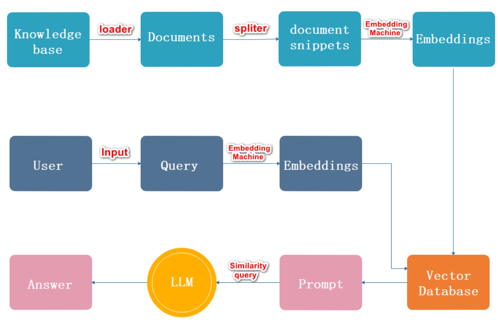
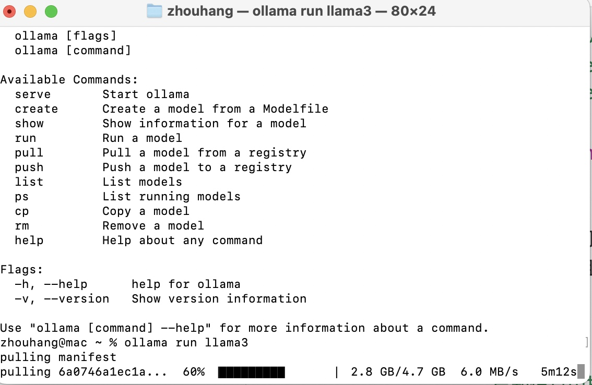
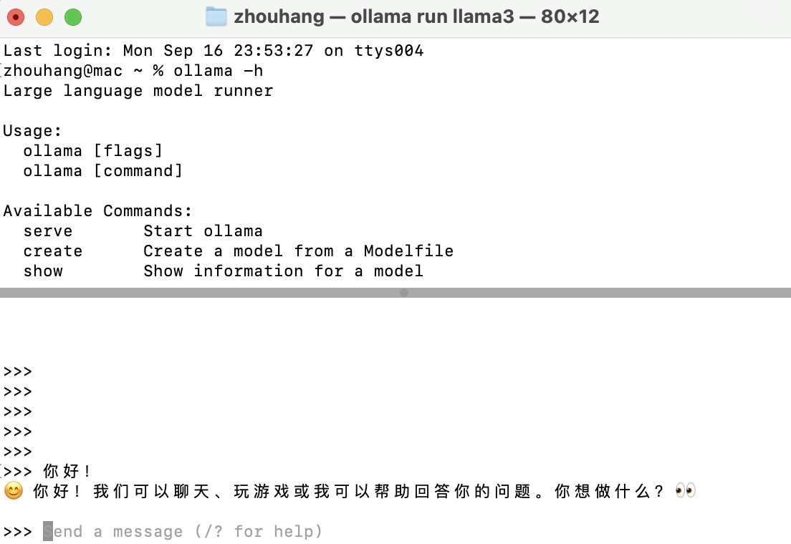
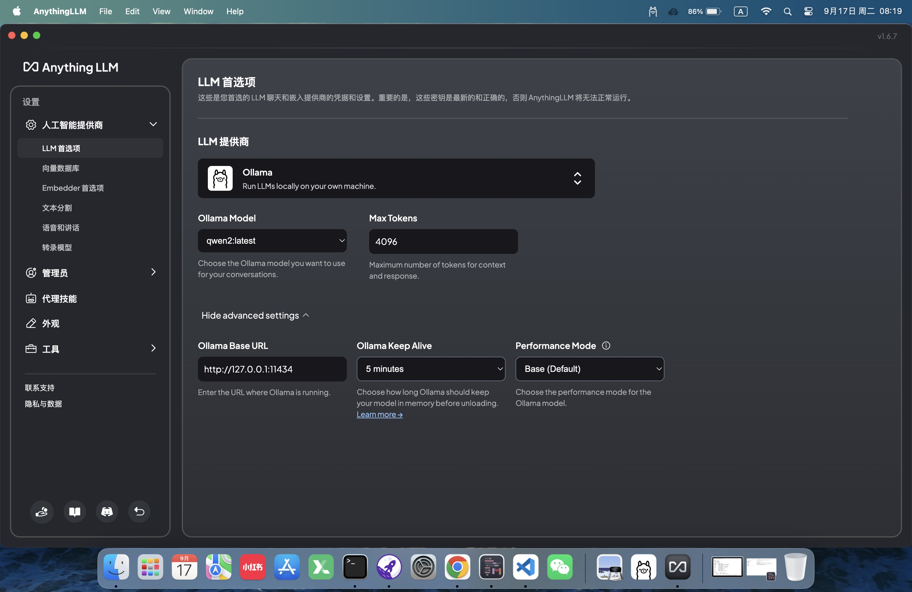
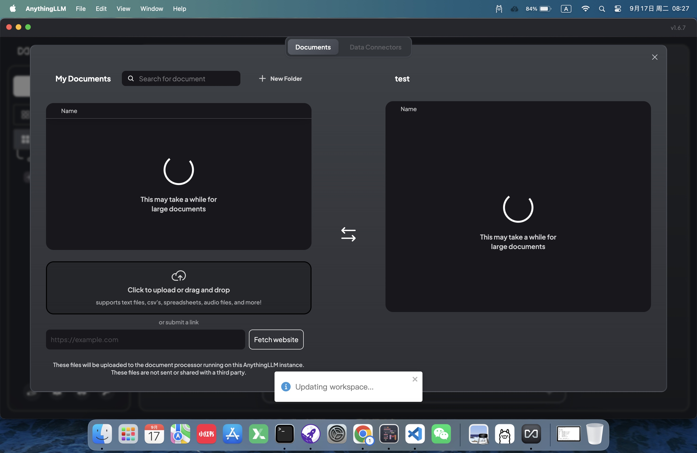
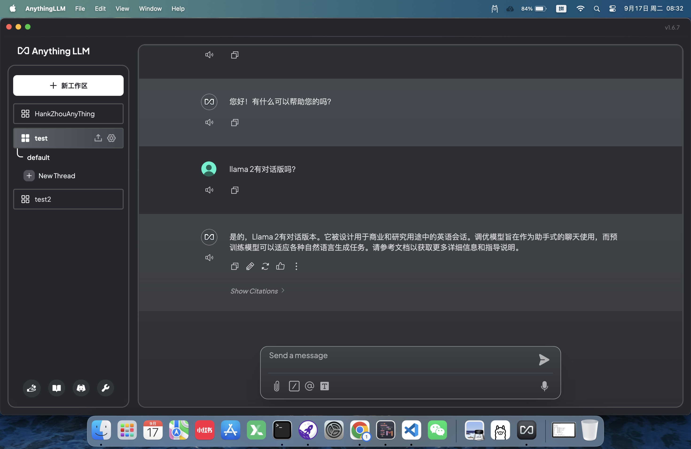

# 大模型RAG技术

英文全称为：Retrieval Augmented Generation，检索增强生成。
顾名思义，就是通过检索外部知识库的方式，增强AI生成内容的能力。

它之所以出现，是因为大模型（LLM）虽然具备类似人脑的思维能力，但是它的知识范围其实是闭塞的，它的能力，从训练结束那一刻开始就固定了。如果要增强能力，可以继续训练，但是众所周知，大模型的训练非常消耗算力，算力包括了硬件支持，以及电力支持，都是不小的成本。


# FunctionCalling和RAG的异同

前面的课程学习了FunctionCalling，它可以通过调用外部函数的方式来使得大模型能访接触到外部数据，将外部数据和模型本身的能力结合起来，实现自然语言答案的输出。

和今天提到的RAG对比一下，两者都旨在提升大模型的能力和输出质量，通过集成额外的信息或功能来增强模型的表现。这是相同点，那么不同点是：

> 1. 实时性差异
> rag的知识库其实是固定的，不具备实时性。而FunctionCalling可以调用网络接口来获取实时数据。
> 2. 能力扩充的方式不同
> rag给大模型扩充知识库，但是如果涉及到复杂运算，还是FunctionCalling更为合适。
> 3. 应用场景不同
> 从实际应用的场景来看，FunctionCalling依赖外部服务，这可能涉及到隐私性和安全性。而如果涉及到公司内部知识库（比如财报，政策等），这种秘密信息，显然RAG更为合适。

# RAG的工作流程



RAG支持的知识库格式包括：文本文件（txt，pdf等），结构化数据（json，xml等）。

大概的流程，通过文字描述如下：

1. 加载读取文档，将文档内容读取到内存中
2. 文档分割，将内存中的文档内容分割保存
3. 文档向量化，将文本形式的内容，通过向量化的技术，组合成向量数据库
4. 用户输入内容
5. 将用户输入的内容向量化
6. 将用户输入的向量化数据，到向量数据库中进行前topK到检索，得到匹配出的结果
7. 将匹配出的结果和问题上下文一起添加到prompt中
8. 将最终的prompt一起提交给大模型进行结果输出

可以看出，其关键环节，其实是 **将用户原本要提交给大模型的prompt提示词进行了篡改**，从而改变了大模型的输出。


# 案例

rag应用的案例。基于openAI，我们提供一个外部的pdf文档，并且提一个这个文档深度关联的问题给openAI，看它是否会给出一个正确的回答。


运行如下代码，需要pip提前安装以下依赖：
- openai
- pdfminer.six
- pdfminer
- chromadb


## 完整代码

```python
from openai import OpenAI
import chromadb
from pdfminer.high_level import extract_pages
from pdfminer.layout import LTTextContainer
from chromadb.config import Settings


api_key = "xk-3c1666dd4a5911efa8a900163e082994caadfccb65c243c9"
base_url = "https://openai.zhixueyouke.cn/v1/"


# 指定向量数据库的文件位置
chromadb.PersistentClient(path="./db")

client = OpenAI(api_key=api_key, base_url=base_url)
prompt_template = """
你是一个问答机器人。
你的任务是根据下述给定的已知信息回答用户问题。
确保你的回复完全依据下述已知信息。不要编造答案。
如果下述已知信息不足以回答用户的问题，请直接回复"我无法回答您的问题"。

已知信息:
__INFO__

用户问：
__QUERY__

请用中文回答用户问题。
"""


# 从一个pdf文件中去提取出所有文字，得到一个字符串数组
def extract_text_from_pdf(filename, page_numbers=None, min_line_length=1):
    """从 PDF 文件中（按指定页码）提取文字"""
    paragraphs = []
    buffer = ""
    full_text = ""
    # 提取全部文本
    for i, page_layout in enumerate(extract_pages(filename)):
        # 如果指定了页码范围，跳过范围外的页
        if page_numbers is not None and i not in page_numbers:
            continue
        for element in page_layout:
            if isinstance(element, LTTextContainer):
                full_text += element.get_text() + "\n"
    # 按空行分隔，将文本重新组织成段落
    lines = full_text.split("\n")
    for text in lines:
        if len(text) >= min_line_length:
            buffer += (" " + text) if not text.endswith("-") else text.strip("-")
        elif buffer:
            paragraphs.append(buffer)
            buffer = ""
    if buffer:
        paragraphs.append(buffer)
    return paragraphs


paragraphs = extract_text_from_pdf(
    "llama2.pdf", page_numbers=[2, 3], min_line_length=10
)


# 封装一个给openAI提问的方法
def get_completion(prompt, model="gpt-3.5-turbo"):
    """封装 openai 接口"""
    messages = [{"role": "user", "content": prompt}]
    response = client.chat.completions.create(
        model=model,
        messages=messages,
        temperature=0,  # 模型输出的随机性，0 表示随机性最小
    )
    return response.choices[0].message.content


# 将rag向量化之后的数据嵌入到提示词中
def build_prompt(prompt_template, **kwargs):
    """将 Prompt 模板赋值"""
    prompt = prompt_template
    for k, v in kwargs.items():
        if isinstance(v, str):
            val = v
        elif isinstance(v, list) and all(isinstance(elem, str) for elem in v):
            val = "\n".join(v)
        else:
            val = str(v)
        prompt = prompt.replace(f"__{k.upper()}__", val)
    return prompt


# 创建一个向量化的数据库
class MyVectorDBConnector:
    def __init__(self, collection_name, embedding_fn):
        chroma_client = chromadb.Client(Settings(allow_reset=True))

        # 为了演示，实际不需要每次 reset()
        # chroma_client.reset()

        # 创建一个 collection
        self.collection = chroma_client.get_or_create_collection(name=collection_name)
        self.embedding_fn = embedding_fn

    def add_documents(self, documents):
        """向 collection 中添加文档与向量"""
        self.collection.add(
            embeddings=self.embedding_fn(documents),  # 每个文档的向量
            documents=documents,  # 文档的原文
            ids=[f"id{i}" for i in range(len(documents))],  # 每个文档的 id
        )

    def search(self, query, top_n):
        """检索向量数据库"""
        results = self.collection.query(
            query_embeddings=self.embedding_fn([query]), n_results=top_n
        )
        return results


# 进行向量化
def get_embeddings(texts, model="text-embedding-3-large"):
    """封装 OpenAI 的 Embedding 模型接口"""
    data = client.embeddings.create(input=texts, model=model).data
    return [x.embedding for x in data]


# 创建一个向量数据库对象
vector_db = MyVectorDBConnector("demo", get_embeddings)

# 向向量数据库中添加文档
vector_db.add_documents(paragraphs)


class RAG_Bot:
    def __init__(self, vector_db, llm_api, n_results=2):
        self.vector_db = vector_db
        self.llm_api = llm_api
        self.n_results = n_results

    def chat(self, user_query):
        # 1. 检索
        search_results = self.vector_db.search(user_query, self.n_results)

        # 2. 构建 Prompt
        prompt = build_prompt(
            prompt_template, info=search_results["documents"][0], query=user_query
        )

        # 3. 调用 LLM
        response = self.llm_api(prompt)
        return response


# 创建一个RAG机器人
bot = RAG_Bot(vector_db, llm_api=get_completion)

user_query = "llama 2有对话版吗？"

response = bot.chat(user_query)

print(response)

```


## 关键代码解析

### pdf文件加载

下面这个方法，从一个pdf文件中提取出了一个字符串数组.

这里使用了 pdfminer 和 pdfminer.six 这两个依赖库中的函数。

```python
def extract_text_from_pdf(filename, page_numbers=None, min_line_length=1):
    """从 PDF 文件中（按指定页码）提取文字"""
    paragraphs = []
    buffer = ""
    full_text = ""
    # 提取全部文本
    for i, page_layout in enumerate(extract_pages(filename)):
        # 如果指定了页码范围，跳过范围外的页
        if page_numbers is not None and i not in page_numbers:
            continue
        for element in page_layout:
            if isinstance(element, LTTextContainer):
                full_text += element.get_text() + "\n"
    # 按空行分隔，将文本重新组织成段落
    lines = full_text.split("\n")
    for text in lines:
        if len(text) >= min_line_length:
            buffer += (" " + text) if not text.endswith("-") else text.strip("-")
        elif buffer:
            paragraphs.append(buffer)
            buffer = ""
    if buffer:
        paragraphs.append(buffer)
    return paragraphs
```

这段，则是指定了，我们要提取的是 llama2.pdf这个文件的第2，3页，每行最少10个字符，如果少于10个，下一行提取出的内容就补充进来。

```python
paragraphs = extract_text_from_pdf(
    "llama2.pdf", page_numbers=[2, 3], min_line_length=10
)
```

这里得到的 paragraphs就是要进行向量化的原始数据。

### 数据向量化

这里使用到了 向量数据库 `chromadb` 依赖库.

这段代码，封装了一个向量数据库的工具类，提供了初始化函数，添加文档函数，以及检索的函数

```python
# 创建一个向量化的数据库
class MyVectorDBConnector:
    def __init__(self, collection_name, embedding_fn):
        chroma_client = chromadb.Client(Settings(allow_reset=True))

        # 为了演示，实际不需要每次 reset()
        # chroma_client.reset()

        # 创建一个 collection
        self.collection = chroma_client.get_or_create_collection(name=collection_name)
        self.embedding_fn = embedding_fn

    def add_documents(self, documents):
        """向 collection 中添加文档与向量"""
        self.collection.add(
            embeddings=self.embedding_fn(documents),  # 每个文档的向量
            documents=documents,  # 文档的原文
            ids=[f"id{i}" for i in range(len(documents))],  # 每个文档的 id
        )

    def search(self, query, top_n):
        """检索向量数据库"""
        results = self.collection.query(
            query_embeddings=self.embedding_fn([query]), n_results=top_n
        )
        return results

```

使用到这个工具类的地方为：

```python
# 创建一个向量数据库对象
vector_db = MyVectorDBConnector("demo", get_embeddings)
# 向向量数据库中添加文档
vector_db.add_documents(paragraphs)
```

上面的代码中提到了一个函数 get_embeddings：
```python
# 进行向量化
def get_embeddings(texts, model="text-embedding-3-large"):
    """封装 OpenAI 的 Embedding 模型接口"""
    data = client.embeddings.create(input=texts, model=model).data
    return [x.embedding for x in data]
```

它则是使用openAI自带的embeddings方法来对内容进行向量化，使用到的向量化的算法是 `text-embedding-3-large`, 最终返回了一个向量数组。

### 封装提问机器人

```python
class RAG_Bot:
    def __init__(self, vector_db, llm_api, n_results=2):
        self.vector_db = vector_db
        self.llm_api = llm_api
        self.n_results = n_results

    def chat(self, user_query):
        # 1. 检索
        search_results = self.vector_db.search(user_query, self.n_results)

        # 2. 构建 Prompt
        prompt = build_prompt(
            prompt_template, info=search_results["documents"][0], query=user_query
        )

        # 3. 调用 LLM
        response = self.llm_api(prompt)
        return response
```

这个机器人，在初始化的时候，必须提供一个 向量数据库对象，一个回答问题的函数。最后的 n_result2，指的是，进行向量检索时的topK的K值。由于向量检索的结果会进行一个排名，设置为1，就是只取匹配程度最高的结果。

使用者机器人的代码为：
```python
# 创建一个RAG机器人
bot = RAG_Bot(vector_db, llm_api=get_completion)

user_query = "llama 2有对话版吗？"

response = bot.chat(user_query)
```

这里的 get_completion 值的就是我们非常熟悉的openai的提问函数。

```python
# 封装一个给openAI提问的方法
def get_completion(prompt, model="gpt-3.5-turbo"):
    """封装 openai 接口"""
    messages = [{"role": "user", "content": prompt}]
    response = client.chat.completions.create(
        model=model,
        messages=messages,
        temperature=0,  # 模型输出的随机性，0 表示随机性最小
    )
    return response.choices[0].message.content
```

我们所提的问题：`llama 2有对话版吗？`,在提交给openai之前，会先从向量数据库中检索相关内容，组装成完整的prompt之后，再交给openai进行自然语言的结果输出。

## 运行结果

`已知信息中提到了Llama 2-Chat，这是Llama 2的一个经过优化用于对话场景的版本。`

# 本节课作业

Anything+Ollama 实现一个知识库的搭建

Ollama是一个快速部署大模型的工具，支持win，mac以及linux。我用mac做实验，从 官网下载了 `https://ollama.com/download` 安装完成之后，我打开终端，运行命令:`ollama run llama3`。


正在下载中。

下载完成之后，可以进行对话。



由于机器配置的原因，使用 llama3 太卡了，所以我换成了 qwen2，又做了一次。

那么下一步，安装一个 anythingLLM，他是一个支持各种大模型的客户端软件。


安装好之后，在设置中找到首选项，设置如下：


选择ollama，剩下的设置不用动。

下一步创建工作区，


创建完成之后，点击`upload a document` 可以上传知识库。    


然后就可以开始对话了，还是按照上面案例那样提问。



看得出来，答案和我们上买呢案例执行完成之后的结果相同。

这可以说明，这个anythingLLM软件 ， 使用向量数据库的原理和上面案例应该是相同的。

此外，在创建工作区完成之后，仍然可以继续上传外部文件，在上图中，有一个上传按钮。


就是中间这个 


点这个上传按钮右边的齿轮，也就是设置按钮，可以对这个工作区的设置进行调整。