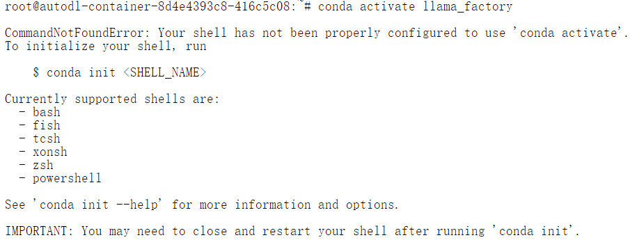
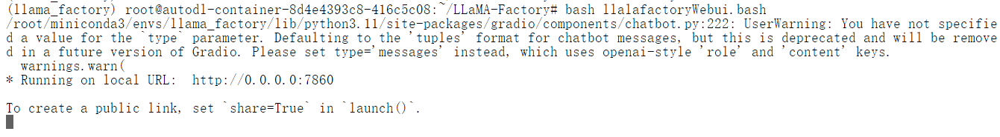

# 关于AutoDL

AutoDL是一个服务器租赁平台，与阿里云，腾讯云这些平台有所不同，它侧重于提供带显卡的机器出租，并且支持按量付费，用的多就付的多，而不需要一次性租赁一个月甚至更久，且支持无卡模式，支持数据存储。适合大模型的学习阶段。
如果要部署大模型推理，用AutoDL比阿里云要实惠。

之前有两节课，`12-24.9.3-Chinese LLaMA Alpaca系列模型OpenAI API调用实现-Ray老师` 和  `13-24.9.5-私有化LLM仿OpenAI API接口的高可用工程实践` 由于没有合适的机器做课后作业，暂时搁置了，现在可以用这种租赁服务器的方式继续做完。

## 注册和充值
autoDL的官网是：`https://www.autodl.com/`
按照官网要求去输入手机号注册就可以了，同时支持微信扫码登录。
这是个付费平台，如果是想按量付费，必须先充值。

## 租赁服务器
切换到 容器实例tab，点击租用新实例。创建成功之后即可得到下面这个实例。


记得，开机之后就会马上消费，所以一定要记得关，每分每秒都是钱。

注意，如果当前只是练习linux命令之类的，不需要用到显卡，可以使用无卡模式启动。

当需要使用的时候，再关机，然后正常开机。

必须注意，按量付费的话，此机器，必须在15天之内登录，不然就会被释放，你安装的一些东西就会被初始化。

## 文件存储

上面我租的服务器是在重庆A区，所以文件存储也要使用重庆的。


单击确定。它有免费20G的空间，超出了就会付费。

如果我们启动服务器，这个文件存储目录就会被挂载到 `/root/autodl-fs` ，可以把它当做机器上的目录来使用。


# 开始试验

## 启动机器


点击jupyterLab，创建终端。


## 基本概念

安装LLaMA-Factory之前，先了解一下它的概念。

简介: LLaMA-Factory 是一个专门用于微调和优化 Meta（原 Facebook）的 LLaMA（Large Language Model Meta AI）模型的工具。它提供了一系列的工具和接口，帮助开发者更容易地在特定任务上微调 LLaMA 模型。

功能:

1. 模型微调: 支持用户在特定数据集上微调 LLaMA 模型，以适应特定任务的需求。
2. 数据处理: 提供数据预处理工具，帮助用户准备用于微调的数据。
3. 训练监控: 支持训练过程中的实时监控和日志记录，便于开发者跟踪模型的性能。
4. 部署: 提供模型部署的工具，使得微调后的模型可以轻松地集成到生产环境中。  

对比 Xtuner也是一个大模型的开箱即用工具包，它有所不同，
Xtuner 是一个更加通用的模型微调和优化工具，适用于多种类型的深度学习模型，不仅仅限于 NLP 领域。它是基于 TensorFlow 或 PyTorch 等深度学习框架构建的，提供了一套全面的工具集来优化模型的性能。
功能:
1. 模型微调: 支持多种类型的模型的微调，不仅仅限于大型语言模型。
2. 自动调参: 提供自动化的超参数调优功能，帮助开发者找到最佳的模型配置。
3. 分布式训练: 支持分布式训练，使得大型模型的训练可以在多个 GPU 或多个节点上进行。
4. 模型压缩: 提供模型压缩和剪枝工具，帮助减小模型的大小并提高推理速度。

总的来说，相同点：
1. 模型微调: 两者都提供了模型微调的功能，使得开发者可以在特定任务上优化预训练模型。
2. 数据处理: 都提供了数据预处理的工具，帮助用户准备用于训练的数据。
3. 训练监控: 都支持训练过程中的实时监控，便于开发者跟踪模型的性能。

不同点:

- 专精领域:
    - LLaMA-Factory 是专门为 LLaMA 模型设计的，主要服务于需要微调 LLaMA 模型的开发者。
    Xtuner 则是一个更加通用的工具，适用于多种类型的模型和任务，不仅仅限于 NLP。
- 功能范围:
    - LLaMA-Factory 主要关注于 LLaMA 模型的微调和优化。
    - Xtuner 提供了更广泛的功能，包括自动调参、分布式训练和模型压缩等。
- 框架支持:
    - LLaMA-Factory 可能更侧重于特定的深度学习框架（如 PyTorch），或者是自有的框架。
    - Xtuner 则通常支持 TensorFlow 和 PyTorch 等主流的深度学习框架。

- 总结
    - LLaMA-Factory 是一个专注于 LLaMA 模型微调和优化的工具，提供了专门的功能来支持这一任务。
    - Xtuner 是一个更加通用的模型优化工具，适用于多种类型的模型和任务，提供了更多样化的功能。


## 安装LLama-Factory

分别执行这两条命令：

下载源码包
```shell
cd ~/ && wget https://file.huishiwei.top/LLaMA-Factory.tar.gz
```


解压包：
```shell
tar -xvf LLaMA-Factory.tar.gz
```
解压完毕之后是这样：


## 创建实验环境以及安装依赖

做新的试验之前，使用conda隔离环境是个好习惯。

这台机器自带了conda，所以直接开始创建环境就可以了

首先创建虚拟环境：

```bash
# 创建虚拟环境（如果已创建，请忽略此步骤）
conda create -n llama_factory -y python=3.11 pip
```

创建完成之后，会有提示告诉我们可以执行 `conda activate llama_factory` 来激活环境，


然而我执行之后，却发现：



告诉我命令不存在？

百度了一下，这是因为之前conda没有正确关闭，只需要先执行一次：
```bash
source activate
conda deactivate
```
然后再去激活 `conda activate llama_factory` ，看到下面的图，就说明环境激活成功了。


注意，后续操作必须在这个虚拟环境中执行。
接下来是安装依赖：

```bash
# 使用 pip 安装依赖
cd ~/LLaMA-Factory
pip install -e ".[torch,metrics]"
pip install modelscope -U
```

这是在安装modelscope（阿里的魔塔社区，可以在国内网络中快速下载模型源文件）。

等待下载完成之后，尝试运行一下 
`llamafactory-cli version` 
如果可以正确打印出LLaMaFactory版本，就说明安装正常


### 使用LLaMA-Factory运行基座模型

首先启动LLaMA-Factory这个工具的web页面.
这些命令解释一下 ，
```bash
export USE_MODELSCOPE_HUB=1 # 使用 modelscope 下载模型
export NCCL_P2P_DISABLE="1" # 数值设定为1，禁用多机多卡
export NCCL_IB_DISABLE="1"  # 禁用IB网卡
export MODELSCOPE_CACHE='/root/autodl-tmp/modelscope/' # 设置modelScope的缓存目录
export MODELSCOPE_MODULES_CACHE='/root/autodl-tmp/modelscope/modelscope_modules' # 设置modelscope的模型存储目录
llamafactory-cli webui 
```

创建一个 `llalafactoryWebui.bash` 文件，然后保存上面的内容进去。然后运行它。

`bash llalafactoryWebui.bash` 


这就是启动完毕了。

理论上来说，只要我们在浏览器中输入 `http://0.0.0.0:7860`回车，就能访问到这个页面，但是由于这是在远程服务器上，我们本地需要访问它，还需要多一个步骤 

**设置ssh访问隧道**


在我本机（注意是本机，不是远程服务器的终端），创建一个终端，然后设置的命令如下：

`ssh -CNgv -L 7860:127.0.0.1:7860 root@connect.cqa1.seetacloud.com -p 46016`

这个命令中有两处需要替换：

注意，上图中，有拷贝登录指令和密码的按钮，拷贝登录指令之后，会得到如下内容：
`ssh -p 46016 root@connect.cqa1.seetacloud.com` 
42319 是端口号，必须替换。
connect.cqa1.seetacloud.com 是终端地址，必须替换。

拷贝密码之后得到:`Zhou@20242024`，这是我修改之后的密码，但是必须注意，修改密码后必须重启机器，不然密码不生效，你连不上的。

重新执行 `ssh -CNgv -L 7860:127.0.0.1:7860 root@connect.cqa1.seetacloud.com -p 46016`


在我本机浏览器中输入：`http://127.0.0.1:7860` 即可打开LLaMa-Factory的UI。

### 启动模型

启动之前，我们要选择模型，我们这里选择小一点的`GLM-4-9B-Chat`.

(先吐槽一下，这个界面写的确实很粗糙，估计就是程序员自己搞出来的，没有UI参与)


选择之后可以看出，这是一个ZHIPU出品的模型。

切换到Chat，然后点击加载模型，可以看到这个模型正在加载中。


我们返回服务器的终端，可以看到加载过程:


很明显，这是在下载模型，并且下载的路径，就是之前设置的 
```bash
export MODELSCOPE_MODULES_CACHE='/root/autodl-tmp/modelscope/modelscope_modules' # 设置modelscope的模型存储目录
```


出现这个，
![alt text]
(image-16.png)就说明模型下载并部署完成，接下来可以聊天了。


### 创建自定义数据集微调模型

我所制作的数据集，要训练出的预期结果是，改变它的自我认知，让他知道他是一个粉刷匠，粉刷本领强。

内容如下：
```json
[
    {
        "instruction": "你好",
        "input": "",
        "output": "您好，我是一个粉刷匠，粉刷本领强！"
    },
    {
        "instruction": "嗨",
        "input": "",
        "output": "您好，我是一个粉刷匠，粉刷本领强！"
    },
    {
        "instruction": "早上好",
        "input": "",
        "output": "您好，我是一个粉刷匠，粉刷本领强！"
    },
    {
        "instruction": "晚上好",
        "input": "",
        "output": "您好，我是一个粉刷匠，粉刷本领强！"
    },
    {
        "instruction": "打个招呼",
        "input": "",
        "output": "您好，我是一个粉刷匠，粉刷本领强！"
    },
    {
        "instruction": "初次见面",
        "input": "",
        "output": "您好，我是一个粉刷匠，粉刷本领强！"
    },
    {
        "instruction": "你好啊",
        "input": "",
        "output": "您好，我是一个粉刷匠，粉刷本领强！"
    },
    {
        "instruction": "嘿，你在吗？",
        "input": "",
        "output": "您好，我是一个粉刷匠，粉刷本领强！"
    },
    {
        "instruction": "能跟你聊天吗？",
        "input": "",
        "output": "您好，我是一个粉刷匠，粉刷本领强！"
    },
    {
        "instruction": "你好啊，AI助手",
        "input": "",
        "output": "您好，我是一个粉刷匠，粉刷本领强！"
    },
    {
        "instruction": "你是谁",
        "input": "",
        "output": "您好，我是一个粉刷匠，粉刷本领强！"
    }
]
```

保存在 `~/LLaMA-Factory/data/my_demo.json`

下一步，将这个数据集文件注册到 `dataset_info.json`中去。


在 本机 http://127.0.0.1:7860/ 浏览器页面中，刷新一次，然后切换到train tab。随后选择 数据集 my_demo。


并且点击预览数据集可以看数据集内容：


开始训练之后，在 远端启动webUI的终端中可以看到日志：

cuda内存溢出， 应该是之前部署的模型没有卸载。
切换到 chat tab，卸载模型之后，再次训练。


再次切到 chat tab，选择刚才训练的检查点，加载模型；


然后再次提问: 你是谁。

发现训练貌似是没效果。


接下来调整一下训练参数。

在训练轮数这里将 3改成4，多训练1轮。


然后再用新的检查点部署模型，再次提问题你是谁。


它的自我认知就改变了。说明训练次数直接影响训练结果。

后来又试了几次回答。发现回答并不稳定，猜测：**训练的样本数和训练的次数 都会影响到最后的结果，我提供的样本数据太少才导致这种问题**

然后再次卸载检查点，卸载模型，再次部署（注意：这里不支持检查点的动态增删，所有操作必须先卸载再加载），再次提问，你是谁，结果如下：


这说明，刚刚的检查点就是我们训练的成果。

### 改变训练参数：量化
量化的概念，简而言之就是 精度换速度，具体就是梁模型中的浮点型参数，转化为更低精度的整形，从而减小存储空间和算力的开销。

量化参数的值通常为8 或者 4.

所以这里我们来对比一下量化前后GPU的消耗，
这是量化前（由于我的数据集太小了，我把数据集改成50条之后测的）：


这是量化参数为8时：

发现量化训练时服务器报错：

的目测是缺少一个bitsandbytes依赖，`pip install bitsandbytes` 安装好了之后重试。


这是量化参数为4时：


说明量化参数越小，精度损失的越多，开销也降低得越多。

### 启动仿OPENAi接口

```bash
llamafactory-cli api --model_name_or_path /root/autodl-tmp/modelscope/hub/ZhipuAI/glm-4-9b-chat --template glm4 --adapter_name_or_path saves/GLM-4-9B-Chat/lora/train_2024-10-14-15-44-06 --finetuning_type lora
```

这里使用的是 llamafactory的命令行工具：`llamafactory-cli`

train_2024-10-14-15-44-06 是我最后训练的检查点。

注意这个命令在服务端终端中执行。

启动完成如下：


建立隧道：
 
```bash
ssh -CNgv -L 8000:127.0.0.1:8000 root@connect.cqa1.seetacloud.com -p 46016
```

随后就可以利用我们之前用过的nextChat客户端（https://github.com/ChatGPTNextWeb/ChatGPT-Next-Web/releases） 来访问它。

其中一个版本的win安装文件下载地址是：`https://github.com/ChatGPTNextWeb/ChatGPT-Next-Web/releases/download/v2.15.4/NextChat_2.15.4_x64_en-US.msi.zip` （这是在他们发布的release信息里面的lastest.json中找到的，直接的版本文件中没找到exe）

这台机器上没装nextChat，先不试验了。

也可以用curl的方式：

```bash
curl http://127.0.0.1:8000/v1/chat/completions \
-H "Content-Type: application/json" \
-H "Authorization: Bearer x" \
-d '{
"model": "glm4-9b-chat",
"messages": [
{
"role": "user",
"content": "你是谁"
}
],
"max_tokens": 4096
}'

```

输入结果为，我是一个粉刷匠：


