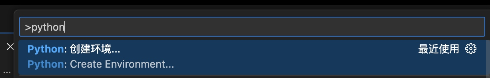
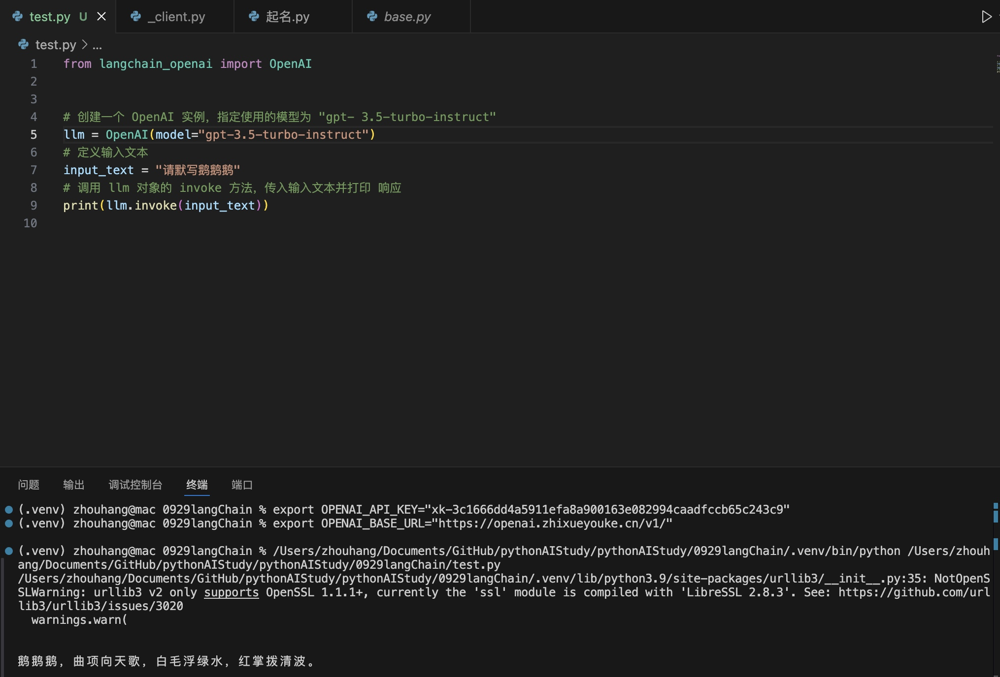

# 我的私人配置，发帖之前记得删

`export OPENAI_API_KEY="xk-3c1666dd4a5911efa8a900163e082994caadfccb65c243c9"`
`export OPENAI_BASE_URL="https://openai.zhixueyouke.cn/v1/"`

# langchain练习

创建虚拟环境并安装对应的依赖。

我是直接用vscode创建的虚拟环境，



（如果虚拟环境未生效，重启vscode可以解决）

在虚拟环境中安装 依赖：`pip install langchain-openai`

然后创建test.py并保存下面的代码：

```python
from langchain_openai import OpenAI


# 创建一个 OpenAI 实例，指定使用的模型为 "gpt- 3.5-turbo-instruct"
llm = OpenAI(
    model="gpt-3.5-turbo-instruct",
)
# 定义输入文本
input_text = "请默写鹅鹅鹅"
# 调用 llm 对象的 invoke 方法，传入输入文本并打印 响应
print(llm.invoke(input_text))
```

如果不出意外的话，应该能输出如下结果：



## mac电脑配置环境变量


步骤 1：确定你使用的 Shell
macOS 自 macOS Catalina 版本以后，默认的 shell 是 zsh，之前的版本默认使用 bash。你可以通过以下命令来确认你当前使用的 shell：

`echo $SHELL`

如果输出是 `/bin/zsh`，你正在使用 zsh。
如果输出是 `/bin/bash`，你正在使用 bash。
步骤 2：编辑相应的配置文件
如果你使用的是 zsh（macOS 我本机就是）：
打开终端，编辑你的 .zshrc 文件：

`nano ~/.zshrc`
在文件末尾添加以下内容（替换为你自己的 API Key 和 URL）：

`export OPENAI_API_KEY="your-api-key-here"`
`export OPENAI_BASE_URL="your-base-url-here"`
保存文件并退出编辑器（在 nano 中，按 Ctrl + X，然后按 Y 确认保存，最后按回车）。

运行以下命令使更改生效：

`source ~/.zshrc`

如果像我一样使用的是虚拟环境的话，直接在venv环境中输入命令：
`export OPENAI_API_KEY="your-api-key-here"`
`export OPENAI_BASE_URL="your-base-url-here"`
回车，然后再执行python文件，也能得到想要的结果。

