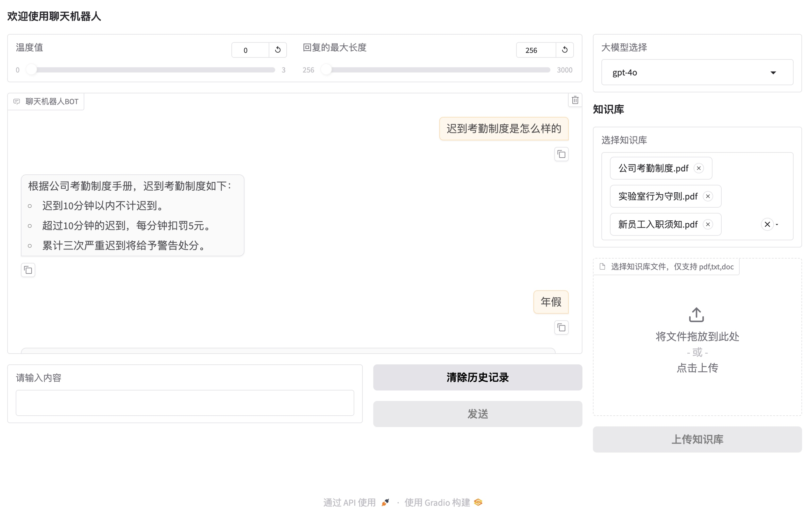
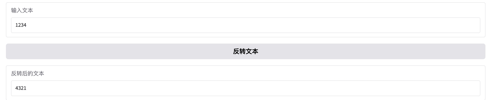

# 先看成品

代码在附件中，代码是跨平台的，在mac/win上应该都可以正常运行，但是最好保持 python版本是3.12.4，如果运行起来发现缺少包，去chatGPT搜索，很容易解决。

运行效果如下：


这是一个简单的大模型问答界面。
主要的组成部分分为以下几个方面：
## 调整大模型常用参数模块
    包括 
    - 温度值 ，用于控制大模型回答的随机性（以openAI为例，值一般在0-2之间）
    - 回复的最大长度，用于控制大模型回复内容的最大长度，如果实际要回答的长度大于设置的值，你可以告诉大模型，继续，以继续输出剩余内容。
    - 模型选择，用于区分不同的模型实例（比如 gpt-4o , gpt-3.5-turbo）
## 聊天模块
    即上图中范围最大的板块（聊天机器人BOT），这里分为两个部分，
    - 聊天记录显示部分，用于存放历史聊天记录
    - 聊天操作组件部分，输入用户提问的内容，另外，支持回车发送，按发送键发送，以及 一键清除历史聊天记录
## 知识库管理模块
    包含
    - 上传知识库的组件（点击上传的组件以及上传知识库按钮）
    - 选择知识库的组件

这些ui元素，全部都是由一个名叫 gradio的 python第三方库构建。用户可以上传知识库，输入提问，发送给AI,稍等片刻便能得到AI的回答。有知识库的情况下，AI的回答会优先参照你提供的知识库文件内容，不会胡编乱造。没选择知识库的情况下，AI会自行根据已训练的数据进行回答。

接下来的正文部分，可以作为阅读源码的参考，帮助理解整个项目的架构。

# 实现方式

## 认识Gradio
从一个老前端开发的角度来看：
`简单一句话概括，它就是一个专注于快速构建机器学习，大模型用户界面的UI框架，通过编写并运行python代码，可以在本机开启一个web服务，展示UI界面，实际上就是将python代码转化成一个个html标签，组成了一个web页面。好处就是，极大的精简了我们测试和验证大模型能力的方式，缺点就是可定制化较弱，如果要做一个非常精美的ToC应用，不太合适。`

接下来从3个不同的层面来对上面实现的效果进行解读：

## 1.UI层面

### 基本认知
```python
import gradio as gr

# 定义一个反转文本的函数
def reverse_text(text):
    return text[::-1]

# 使用 gr.Blocks 创建界面
with gr.Blocks() as demo:
    # 创建一个文本输入框
    input_text = gr.Textbox(label="输入文本")
    
    # 创建一个按钮
    btn = gr.Button("反转文本")
    
    # 创建一个文本输出框
    output_text = gr.Textbox(label="反转后的文本")
    
    # 定义按钮点击事件的处理函数
    btn.click(fn=reverse_text, inputs=input_text, outputs=output_text)

# 启动 Gradio 应用
demo.launch()
```
就上面这段代码，就能显示出如下UI：


这里必须强调gradio的一个关于 click事件设计的重要概念。
- fn：点击按钮时触发的函数
- inputs：可以是单个组件，也可以是一个组件数组，但是有一点，这里传入的组件的个数，最好和触发函数的入参个数对等，比如上面例子中只写了一个input_text，那么 reverse_text的入参就只有一个text。
- outputs：可以是单个组件，也可以是组件数组，但是同理，fn函数的返回值的个数，必须和outputs中的组件个数对等，否则代码可能会抛错

接下来我总结其他一些特别需要注意的点：
### 如何动态改变一个按钮的交互状态（enable/disable）

如果一个按钮，在输入框内容非空时，才能允许点击，如何实现？
```python
import gradio as gr


# 定义一个函数，用于动态改变按钮的 interactive 状态
def toggle_button_interactive(input_text):
    # 如果输入框内容非空，则按钮可点击，否则不可点击
    interactive_button = input_text.strip() != ""
    # 返回新的按钮 interactive 状态和状态信息
    return gr.update(interactive=interactive_button)


# 使用 gr.Blocks 创建界面
with gr.Blocks() as demo:
    # 创建一个文本输入框
    input_text = gr.Textbox(label="输入内容以启用按钮")

    # 创建一个按钮，初始状态为不可交互
    btn = gr.Button("提交", interactive=False)

    # 定义输入框内容变化时的事件处理逻辑
    input_text.change(fn=toggle_button_interactive, inputs=[input_text], outputs=[btn])

# 启动 Gradio 应用
demo.launch()
```

### 如何在应用启动的时候预执行一个函数并拿到返回结果显示在ui中

举个例子：如果有一个支持多选的下拉框，我想要读取一个本地目录，拿到其中所有的File名字，并组成数组显示在下拉框中。

```python
import gradio as gr
import os


class FileOperator:
    files = []

    def get_files_from_directory(self):
        directory = "知识库源文件"
        # 读取目录中的文件名
        self.files = [
            f
            for f in os.listdir(directory)
            if os.path.isfile(os.path.join(directory, f))
        ]
        print("directors", self.files)
        return self.files


fileOperator = FileOperator()

# 使用 gr.Blocks 创建界面
with gr.Blocks() as demo:
    # 创建一个多选下拉框，初始值就是读取某目录下的所有文件
    file_dropdown = gr.Dropdown(
        label="选择文件",
        choices=fileOperator.get_files_from_directory(),
        value=fileOperator.files,
        multiselect=True,
    )

# 启动 Gradio 应用
demo.launch()
```

简单来说，就是ui元素的每个属性都是逐个串行加载的，按上面的代码，会先执行  fileOperator.get_files_from_directory()，给fileOperator实例的 files属性进行赋值，等走到value=等时候，files的值已经是非空了。

### 如何连续性改变一个UI元素的显示内容

一个很典型的例子就是，聊天框 chatBot，我们将问题发送给AI之前，首先聊天框中必须出现我们提的问题，然后等AI给我们回复了，再将AI回复的内容逐个显示出来。

```python
import gradio as gr
import time


# 定义一个函数，用于逐字显示AI回复
def simulate_ai_response(text):
    for i in range(1, len(text) + 1):
        yield text[:i]
        time.sleep(0.05)  # 模拟逐字显示的效果


# 定义一个函数，用于处理用户输入并生成对话记录
def chat(user_input, chat_history):
    # 首先将用户的问题添加到聊天记录中
    chat_history.append((user_input, None))

    # 模拟AI逐字回复
    ai_response = simulate_ai_response("这是一个模拟的AI回复。")
    for response in ai_response:
        chat_history[-1] = (user_input, response)
        yield chat_history


# 创建 Gradio 界面
with gr.Blocks() as demo:
    # 创建一个聊天框和一个输入框
    chatbot = gr.Chatbot(label="聊天框")
    user_input = gr.Textbox(label="输入问题")

    # 创建一个按钮，用于发送用户输入
    send_button = gr.Button("发送")

    # 定义按钮点击事件
    send_button.click(
        chat,  # 处理用户输入的函数
        inputs=[user_input, chatbot],  # 输入：用户输入和聊天记录
        outputs=[chatbot],  # 输出：聊天框和更新后的聊天记录
        show_progress=True,
    )

# 启动 Gradio 应用
demo.launch()
```
当我们输入好问题，点发送按钮时。chat函数会首先生成一个模拟回复，每隔0.05秒向外抛出一个字符，从而呈现出字符逐个打印的效果。这里的yeild函数起了主要作用。

## 2. 大模型调用层面

### 基本认知
我的代码中使用langchain编写调用大模型的核心步骤，从点击发送按钮开始追踪代码。

```python
    ...
    send_btn.click(
        fn=process_send,
        inputs=[msg_textbox, chatbot_box],
        outputs=[chatbot_box, msg_textbox],
    ).then(
        fn=llm_reply,  # AI回复
        inputs=[
            konwledge_select,
            chatbot_box,
            model_select,
            tempatureSlider,
            replyMaxCountSlider,
        ],  # 输入组件 chatBox聊天历史， model_select 模型选择,tempatureSlider温度选择， replyMaxCountSlider 回复最大长度
        outputs=[chatbot_box],
    )
```
上面代码中，click事件触发之后，首先执行process_send，先将用户提问显示在聊天框：
```python
def user_send(history, user_message):
    print("history:", history)
    print("user_message:", user_message)
    """
    将用户的消息添加到历史记录中，显示用户头像
    :param history: 聊天记录
    :param user_message: 用户消息
    :return: 更新后的聊天记录
    """
    formatted_user_message = f"{user_message}"
    formatted_ai_response = f"AI思考中..."
    history.append((formatted_user_message, formatted_ai_response))
    return history, ""  # 第二个空字符串是为了清空输入框


def process_send(user_message, history):
    """
    发送按钮的点击事件处理函数
    :param user_message: 用户消息
    :param history: 聊天记录
    :return: 更新后的聊天记录和清空的文本框
    """
    if user_message.strip():
        return user_send(history, user_message)
    else:
        return history, ""
```

随后，继续执行llm_reply调用大模型，这里是重点内容。
所有关于大模型调用的内容，全部封装在 my_llm.py文件中。 
接下来按照逻辑顺序进行分别讲解。

### 1. llm_reply 触发AI的入口
```python
def llm_reply(collections, chat_history, model, temperature, max_length):
    # 获得用户提的最后一个问题
    question = chat_history[-1][0]  # 倒数第一对记录，取0位置，也就是用户发送的内容
    # 使用问答链进行回复
    print("---question:", question)
    print("---model:", model)
    print("---max_length:", max_length)
    print("temperature:", temperature)
    response = llm.stream(collections, question, model, max_length, temperature)
    print("response:", response)
    chat_history[-1][1] = ""  # 先把AI的回复清空
    print("chat_history:", chat_history)

    for chunk in response:
        # print("chunk:", chunk)
        if "context" in chunk:
            for doc in chunk["context"]:
                print("doc:", doc)
        if "answer" in chunk:
            chunk_content = chunk["answer"]
            # print("chunk_content", chunk_content)
            if chunk_content is not None:
                chat_history[-1][1] += chunk_content
                yield chat_history
    print("chat_history")
```

### 2. llm.stream 执行流式回复

```python
    def stream(self, collections: List[str], question, model, max_length, temperature):
        print(">>>question:", question)
        print(">>>model:", model)
        print(">>>max_length:", max_length)
        print(">>>temperature:", temperature)
        return self.get_chain(collections, model, max_length, temperature).stream(
            {"input": question},
            {"configurable": {"session_id": "unused"}},  # 这个unused应该是和历史有关系
        )
```

### 3. 创建大模型调用链

```python
def get_chain(self, collections, model, max_length, temperature):
        retriever = None

        if collections:
            retriever = self.get_retrievers(collections)

        print("开始创建chain，保留最后6条历史")
        # 为了节约性能，不要在每次getChain的时候都去读取全部记忆
        if len(self.__chat_history.messages) > 6:
            self.__chat_history.messages = self.__chat_history.messages[
                -6:
            ]  # 只保留最后6条
        print("开始创建 ChatOpenAI")
        chat = ChatOpenAI(
            model=model, temperature=temperature, max_tokens=max_length
        )  # 创建client，为创建链条做准备

        print("开始创建 chain")

        # 考虑rag的情况
        if retriever:
            # 知识库问答指令
            qa_system_prompt = (
                "你叫瓜皮，一个帮助人们解答各种问题的助手。 "
                "使用检索到的上下文来回答问题。如果你不知道答案，就说你不知道。 "
                "\n\n"
                "{context}"
            )
            qa_prompt = ChatPromptTemplate.from_messages(
                [
                    ("system", qa_system_prompt),
                    ("placeholder", "{chat_history}"),
                    ("human", "{input}"),
                ]
            )
            chain = create_stuff_documents_chain(chat, qa_prompt)
            chain = create_retrieval_chain(retriever, chain)
            print("rag_chain:", chain)
        else:
            system_prompt = (
                "你叫豆瓜，一个帮助人们解答各种问题的助手。"  # 定义AI的自我认知
            )
            normal_prompt = ChatPromptTemplate.from_messages(
                [
                    ("system", system_prompt),
                    ("placeholder", "{chat_history}"),
                    ("human", "{input}"),
                ]
            )
            chain = normal_prompt | chat | streaming_parse  # 创建基础链条

        # 创建一个带聊天记忆的链条
        memoryed_chain = RunnableWithMessageHistory(
            chain,
            lambda session_id: self.__chat_history,
            input_messages_key="input",
            history_messages_key="chat_history",
            output_messages_key="answer",
        )
        print("开始创建 memoryed_chain")

        return memoryed_chain
```

## 3. Rag外部知识库层面

在第一章节的图中有一个 知识库管理模块。
知识库的导入，分割，向量化。以及 大模型调用时的知识库检索，优化，都和它息息相关。

### 知识库的导入

回到ui层面，找到 文件上传组件，`gr.File`

```python
file_upload = gr.File(
                label="选择知识库文件，仅支持 pdf,txt,doc",
                type="filepath",
                file_count="multiple",
            )
```
这是一个文件选择的组件，点击之后可以打开文件选择器，让你可以单选或者多选本地文件。还能支持文件格式的限定，只不过这种限定有bug，一般不用。
特别注意，我传的type时filepath，这意味着当我选择文件之后，它会将文件路径传递出去（如果不是filepath，它会直接将文件的二进制内容拷贝到磁盘的一个默认路径，mac和win分别有不同的位置）

然后，顺着往下找可以看到上传按钮：
```python
            ...
            # 处理按钮
            submit_btn = gr.Button("上传知识库", interactive=False)
            err_text = gr.Markdown()
            submit_btn.click(
                fn=upload_knowledge_base,
                inputs=file_upload,
                outputs=[file_upload, konwledge_select, err_text],
            )
            file_upload.change(
                fn=enable_upload_button, inputs=file_upload, outputs=submit_btn
            )
```
点击上传之后，触发`upload_knowledge_base` 函数，这个函数一次性返回3个值，它的代码如下：

```python
def upload_knowledge_base(file_paths):
    """
    复制指定路径的文件到目标目录

    :param file_paths: 文件路径的数组
    :param target_directory: 文件复制后的目标目录
    """
    unsupported_files = []
    # 在这里判断支持上传的文件类型
    allowed_extensions = [".pdf", ".txt", ".doc"]
    # 如果发现不支持的文件格式，则直接提醒
    for file_path in file_paths:
        # 获取文件扩展名
        _, ext = os.path.splitext(file_path)

        # 检查扩展名是否支持
        if ext.lower() not in allowed_extensions:
            unsupported_files.append(file_path)

    if unsupported_files:
        print("发现不支持的文件格式:")
        for file in unsupported_files:
            print(file)
        s = "\n".join(unsupported_files)
        return (
            None,
            gr.update(
                choices=llm.knowledge_file_embedding(),
                value=[],
            ),
            f"发现不支持的文件 {s}",
        )
    else:
        print("所有文件格式均支持。")

    # 创建目标目录（如果不存在）
    if not os.path.exists(KNOWLEDGE_DIR):
        os.makedirs(KNOWLEDGE_DIR)

    # 遍历文件路径，将文件复制到目标目录
    for file_path in file_paths:
        # 获取文件名
        file_name = os.path.basename(file_path)
        # 目标路径
        target_path = os.path.join(KNOWLEDGE_DIR, file_name)
        try:
            # 复制文件到目标路径
            shutil.copy(file_path, target_path)
            print(f"已复制文件: {file_name} 到 {KNOWLEDGE_DIR}")
        except Exception as e:
            print(f"复制文件 {file_name} 失败: {e}")

    return (
        None,
        gr.update(
            choices=llm.knowledge_file_embedding(),
            value=llm.collections[:1],
        ),
        "",
    )
```

它的主要逻辑如下
1. 接收一个 List[str] 类型的参数，也就是将要上传的文件路径列表
2. ".pdf", ".txt", ".doc" 是我规定的3种支持的文件格式，如果参数的文件列表中包含其他格式，则这一批次的文件都不准上传
3. 通过遍历文件列表，将这些文件逐个拷贝到指定的目录
4. 最后return的结果中，第一个None是为了清空 gr.File组件的内容，第三个是为了让错误信息的text置空。而第二个，则是为了实现文件的向量化，并且把向量化之后的结果传递到 知识库选择的组件。也就是
   ```python
               konwledge_select = gr.Dropdown(
                choices=llm.knowledge_file_embedding(),# 可选值
                value=llm.collections,# 当前选择
                label="选择知识库",
                interactive=True,
                scale=1,
                multiselect=True,
            )
   ```
### 知识库文件的分割和向量化
上一章节中，经过了文件上传之后，在我指定的目录中就存在了需要被向量化的所有文件，那么llm.knowledge_file_embedding() 这个函数，就是将这些文件逐个进行向量化，生成向量化的产物。

```python
def knowledge_file_embedding(self):
        os.makedirs(os.path.dirname(KNOWLEDGE_DIR), exist_ok=True)  # 创建

        list = os.listdir(KNOWLEDGE_DIR)
        print("已有的知识库", list)
        self.collections = []
        for file in list:
            print(file)
            self.collections.append(file)
            file_path = os.path.join(KNOWLEDGE_DIR, file)
            collection_name = get_md5(file)  # 用md5算法对一个知识库进行唯一标识

            # 过滤掉已经向量化的文件放置重复动作
            if collection_name in self.__retrievers:
                continue
            loader = MyCustomLoader(file_path)
            print("loader", loader)
            self.__retrievers[collection_name] = self.create_indexes(
                collection_name, loader, embeddings
            )
            print("collections:", self.collections)
        return self.collections
```
它的主要逻辑如下
- 遍历目录，找到每一个文件，首先按照文件名的md5值，创建该文件对应的向量化产物的存储位置
- 为了防止重复向量化（它是一个重量级的操作，比较耗时且耗资源），利用一个 _retrievers变量来存储已经向量化的文件，避免不必要的资源消耗
- 创建 文件内容的加载器 MyCustomLoader，并将它传递给create_indexes函数，来进行向量化。

接下来的，MyCustomLoader的代码如下：

```python
class MyCustomLoader(BaseLoader):

    # 支持加载的文件类型
    file_type = {
        FileType.CSV: (CSVLoader, {"autodetect_encoding": True}),
        FileType.TXT: (TextLoader, {"autodetect_encoding": True}),
        FileType.PDF: (PyPDFLoader, {}),
        FileType.DOC: (UnstructuredWordDocumentLoader, {}),
        FileType.DOCX: (UnstructuredWordDocumentLoader, {}),
        FileType.MD: (UnstructuredMarkdownLoader, {}),
    }

    # 初始化方法  将加载的文件进行切分
    def __init__(self, file_path: str):
        loader_class, params = self.file_type[
            detect_filetype(file_path)
        ]  # 加载对应的文件加载器
        print("loader_class:", loader_class)
        print("params:", params)
        self.loader: BaseLoader = loader_class(file_path, **params)
        print("self.loader:", self.loader)
        self.text_splitter = RecursiveCharacterTextSplitter(  # 内容分隔
            separators=["\n\n", "\n", " ", ""],
            chunk_size=1000,  # 每1000个字符分隔一次
            chunk_overlap=200,  # 用末尾200个字符当做衔接词，增强语义
            length_function=len,
        )

    def lazy_load(self):
        # 懒惰切分加载
        return self.loader.load_and_split(self.text_splitter)

    def load(self):
        # 加载
        return self.lazy_load()
```

它是BaseLoader的一个子类。它规定了我需要支持的文件类别，并设定好每种格式的加载器（比如PyPDFLoader就是专门用来加载和分割pdf的），以及内容分割器 RecursiveCharacterTextSplitter的主要参数（分隔符，分段size，用于衔接增强语义的字符个数。）

接下来就应该分析  MyLLM类的create_indexes 函数。它的作用是为每个文件创建索引，
首先了解一下为什么要创建索引？
官方参考资料：`https://python.langchain.com/v0.2/docs/how_to/indexing/`
关键文字翻译出来的意思如下：
```
索引 API 可让您将来自任何来源的文档加载到向量存储中并保持同步。具体来说，它有助于：
避免将重复的内容写入向量存储
避免重写不变的内容
避免对未改变的内容重新计算嵌入
所有这些都可以节省您的时间和金钱，并改善您的矢量搜索结果。
至关重要的是，即使对于相对于原始源文档已经经过多个转换步骤（例如，通过文本分块）的文档，索引 API 也能发挥作用。
```
总之一句话，文件向量化是重量级过程，我们应该尽量避免不必要的时间或者资源成本。


create_indexes代码如下，详细解释请看注释：
```python
def create_indexes(
        self,
        collection_name: str,
        loader: BaseLoader,
        embedding_function: Optional[Embeddings] = None,
    ):
        # 使用chroma这个向量数据库来做向量化
        db = Chroma(
            collection_name=collection_name,
            embedding_function=embedding_function,
            persist_directory=os.path.join("./chroma", collection_name),
        )

        record_manager = SQLRecordManager(
            f"chromadb/{collection_name}", db_url="sqlite:///record_manager_cache.sql"
        )
        record_manager.create_schema()
        documents = loader.load()
        r = index(documents, record_manager, db, cleanup="full", source_id_key="source") # 建立索引
        ensemble_retriever = EnsembleRetriever(
            retrievers=[
                db.as_retriever(search_kwargs={"k": 3}),
                BM25Retriever.from_documents(documents),
            ]
        )

        return ensemble_retriever
```
它的主要逻辑如下：
- 创建Chroma（向量数据库的一种），所使用的入参是：collection_name 名称，embedding_function 嵌入式模型，以及 persist_directory 数据库持久化的存储路径。
- record_manager.create_schema 创建数据库来管理文档的源数据，并且确保数据库模式已经创建
- documents = loader.load() 读取文档内容，并得到分割之后的内容碎片
- index(documents, record_manager, db, cleanup="full", source_id_key="source") 建立索引
- ensemble_retriever = EnsembleRetriever(...) 创建混合检索器，结合了稀疏检索器（如 BM25）和密集检索器（如嵌入相似性）。
- return ensemble_retriever 将检索器对象返回出去

所以我们上传的每个文件都将会在内存中生成一个 Retriever对象，用于文档检索。
至此，向量化的过程结束。

### 知识库的匹配

那么当我们给AI提出问题时，代码是如何找到对应的文档，并生成文档相关的回答的呢？
我们回到 my_bot文件的llm_reply：
```python
def llm_reply(collections, chat_history, model, temperature, max_length):
    # 获得用户提的最后一个问题
    question = chat_history[-1][0]  # 倒数第一对记录，取0位置，也就是用户发送的内容
    # 使用问答链进行回复
    print("---question:", question)
    print("---model:", model)
    print("---max_length:", max_length)
    print("temperature:", temperature)
    response = llm.stream(collections, question, model, max_length, temperature)
```
这里有个llm.stream函数，进去看看：
```python
    def stream(self, collections: List[str], question, model, max_length, temperature):
        print(">>>question:", question)
        print(">>>model:", model)
        print(">>>max_length:", max_length)
        print(">>>temperature:", temperature)
        return self.get_chain(collections, model, max_length, temperature).stream(
            {"input": question},
            {"configurable": {"session_id": "unused"}},  # 这个unused应该是和历史有关系
        )
```
这里实际上调用了get_chain的stream函数（它是一个系统函数，所以我们直接看get_chain）:

```python
def get_chain(self, collections, model, max_length, temperature):
        retriever = None

        if collections:
            retriever = self.get_retrievers(collections)

        print("开始创建chain，保留最后6条历史")
        # 为了节约性能，不要在每次getChain的时候都去读取全部记忆
        if len(self.__chat_history.messages) > 6:
            self.__chat_history.messages = self.__chat_history.messages[
                -6:
            ]  # 只保留最后6条
        print("开始创建 ChatOpenAI")
        chat = ChatOpenAI(
            model=model, temperature=temperature, max_tokens=max_length
        )  # 创建client，为创建链条做准备

        print("开始创建 chain")

        # 考虑rag的情况
        if retriever:
            # 知识库问答指令
            qa_system_prompt = (
                "你叫瓜皮，一个帮助人们解答各种问题的助手。 "
                "使用检索到的上下文来回答问题。如果你不知道答案，就说你不知道。 "
                "\n\n"
                "{context}"
            )
            qa_prompt = ChatPromptTemplate.from_messages(
                [
                    ("system", qa_system_prompt),
                    ("placeholder", "{chat_history}"),
                    ("human", "{input}"),
                ]
            )
            chain = create_stuff_documents_chain(chat, qa_prompt)
            chain = create_retrieval_chain(retriever, chain)
            print("rag_chain:", chain)
        else:
            system_prompt = (
                "你叫豆瓜，一个帮助人们解答各种问题的助手。"  # 定义AI的自我认知
            )
            normal_prompt = ChatPromptTemplate.from_messages(
                [
                    ("system", system_prompt),
                    ("placeholder", "{chat_history}"),
                    ("human", "{input}"),
                ]
            )
            chain = normal_prompt | chat | streaming_parse  # 创建基础链条

        # 创建一个带聊天记忆的链条
        memoryed_chain = RunnableWithMessageHistory(
            chain,
            lambda session_id: self.__chat_history,
            input_messages_key="input",
            history_messages_key="chat_history",
            output_messages_key="answer",
        )
        print("开始创建 memoryed_chain")

        return memoryed_chain
```
它的逻辑如下：
- 如果我们选择了知识库，我们必须把所有需要检索的知识库的retriever组合成一个retriever，传给最终的chain
- 为了节约性能，不要在每次getChain的时候都去读取全部记忆，只保留最后6条
- 创建 聊天模型对象（ChatOpenAI）
- 有知识库和没有知识库走不同的逻辑，提示词就完全不同，
    - 在有知识库的情况下，我们必须传入上下文context，我们只需要写一个占位符即可，底层代码会默认填入。并且会经历：create_stuff_documents_chain 和 create_retrieval_chain 两次包装，生成最终的chain。
    - 没有知识库的情况下，直接用LCEL语法拼装了一个chain
- 最终创建一个带记忆的链条，返回出去


### 知识库的检索优化

上面的代码中，还存在一个关键函数，MyLLM的get_retrievers函数。
```python
def get_retrievers(self, collections):
        retrievers = []
        for collection in collections:
            if collection is None:
                continue
            print("collection:", collection)
            colleciton_name = get_md5(collection)
            print("知识库名字md5:", colleciton_name)
            if colleciton_name not in self.__retrievers:
                return None
            retriever = self.__retrievers[colleciton_name]
            contextualCompressionRetriever = ContextualCompressionRetriever(
                base_compressor=LLMChainFilter.from_llm(self.__llm),
                base_retriever=RePhraseQueryRetriever.from_llm(retriever, self.__llm),
            )
            """rerank https://python.langchain.com/v0.2/docs/integrations/document_transformers/cross_encoder_reranker/"""
            model = HuggingFaceCrossEncoder(
                model_name=rerank_model, model_kwargs=model_kwargs
            )
            compressor = CrossEncoderReranker(model=model, top_n=3)

            compression_retriever = ContextualCompressionRetriever(
                base_compressor=compressor,
                base_retriever=contextualCompressionRetriever,
            )
            retrievers.append(compression_retriever)

        if len(retrievers) == 0:
            return None

        # print("最终检索器列表", ">" * 10, retrievers)

        return EnsembleRetriever(retrievers=retrievers)
```
主要逻辑如下：
1. 遍历所有需要生成retriever的知识库，并拿到他们每一个的md5值
2. 如果某个md5值不在__retrievers中，则不进行处理（__retrievers是一个映射，或者说字典，它保存了所有知识库文件的md5值和向量化产物的对应关系）
3. retriever = self.__retrievers[colleciton_name]：如果 colleciton_name 存在于 self.__retrievers 字典中，则从字典中获取对应的检索器。
4. `contextualCompressionRetriever = ContextualCompressionRetriever( base_compressor=LLMChainFilter.from_llm(self.__llm), base_retriever=RePhraseQueryRetriever.from_llm(retriever, self.__llm), )`：创建一个 ContextualCompressionRetriever 对象，它包含一个基于 LLM 的过滤器和一个基于 LLM 的重述查询检索器。
5. `model = HuggingFaceCrossEncoder( model_name=rerank_model, model_kwargs=model_kwargs )`：创建一个 HuggingFaceCrossEncoder 对象，用于对检索结果进行重排。
6. `compressor = CrossEncoderReranker(model=model, top_n=3)：创建一个 CrossEncoderReranker` 对象，它使用 HuggingFaceCrossEncoder 模型对检索结果进行重排，并返回前三个结果。
7. `compression_retriever = ContextualCompressionRetriever( base_compressor=compressor, base_retriever=contextualCompressionRetriever, )`：创建一个 ContextualCompressionRetriever 对象，它包含一个基于 CrossEncoderReranker 的压缩器和一个基于 ContextualCompressionRetriever 的检索器。
8. `retrievers.append(compression_retriever)`：将创建的 compression_retriever 添加到 retrievers 列表中。
9. `return EnsembleRetriever(retrievers=retrievers)`：如果 retrievers 列表不为空，则返回一个 EnsembleRetriever 对象，它包含了所有创建的检索器。

上面第五步中，提到了一个rerank_model，它是我下载在本地的一个模型`rerank_model = "BAAI/bge-reranker-large"`,作用是：对检索的结果进行重排，提高检索的准确性。
详细解释如下：
- rerank_model 是一个用于重新排序检索结果的模型。在这个上下文中，它是一个基于 BAAI/bge-reranker-large 的模型，这是一个预训练的模型，专门用于对检索结果进行重新排序。

- 在信息检索中，通常会使用一个检索器（如 BM25Retriever）来从知识库中检索出一组相关的文档。然而，这些文档的相关性可能不是最优的，因为检索器可能无法捕捉到文档之间的细微差别。这时，就可以使用一个重排序模型来对检索结果进行重新排序，以提高检索结果的质量。

- rerank_model 的作用就是对检索器返回的文档进行重新排序。它会根据文档的内容和查询的相关性，对文档进行打分，并根据分数对文档进行排序。这样，最相关的文档就会排在最前面，从而提高检索的准确性和效率。

- 在代码中，rerank_model 被用于创建一个 HuggingFaceCrossEncoder 对象，这个对象是一个基于 Hugging Face 的交叉编码器，专门用于对检索结果进行重排序。具体来说，它会将查询和每个文档分别编码成向量，然后计算它们之间的相似度，最后根据相似度对文档进行排序。

- 总的来说，rerank_model 是一个用于提高检索结果质量的重要组件，它通过对检索结果进行重新排序，帮助用户更快地找到最相关的信息。


