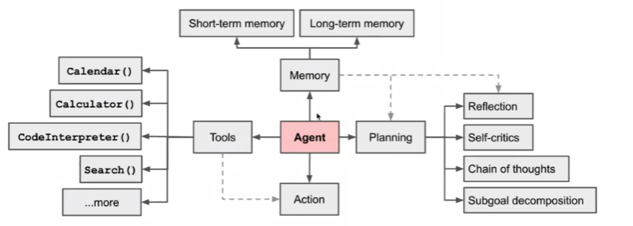

# Agent原理图




# 作业1 利用国产大模型，试验functionCalling


用智谱清言来试试看。

查一下怎么用它来执行functionCalling：
查到文档：https://open.bigmodel.cn/dev/howuse/functioncall

使用方法和openai完全一样。

这是demo代码
```python
import json
from zhipuai import ZhipuAI

client = ZhipuAI(api_key="193a1aedb1873fba8e140ee9b738799f.BubNx88n1NxWqauK")

# 这是两个外部函数，也就是被大模型在特定情况下调用的
# 获得航班号
def get_flight_number(date:str , departure:str , destination:str):
    flight_number = {
        "北京":{
            "上海" : "1234",
            "广州" : "8321",
        },
        "上海":{
            "北京" : "1233",
            "广州" : "8123",
        }
    }
    return { "flight_number":flight_number[departure][destination] }

# 获得航班票价
def get_ticket_price(date:str , flight_number:str):
    return {"ticket_price": "1000"}


messages = []
tools = [
    {
        "type": "function",
        "function": {
            "name": "get_flight_number",
            "description": "根据始发地、目的地和日期，查询对应日期的航班号",
            "parameters": {
                "type": "object",
                "properties": {
                    "departure": {
                        "description": "出发地",
                        "type": "string"
                    },
                    "destination": {
                        "description": "目的地",
                        "type": "string"
                    },
                    "date": {
                        "description": "日期",
                        "type": "string",
                    }
                },
                "required": [ "departure", "destination", "date" ]
            },
        }
    },
    {
        "type": "function",
        "function": {
            "name": "get_ticket_price",
            "description": "查询某航班在某日的票价",
            "parameters": {
                "type": "object",
                "properties": {
                    "flight_number": {
                        "description": "航班号",
                        "type": "string"
                    },
                    "date": {
                        "description": "日期",
                        "type": "string",
                    }
                },
                "required": [ "flight_number", "date"]
            },
        }
    },
]


# 解析 
def parse_function_call(model_response,messages):
    # 处理函数调用结果，根据模型返回参数，调用对应的函数。
    # 调用函数返回结果后构造tool message，再次调用模型，将函数结果输入模型
    # 模型会将函数调用结果以自然语言格式返回给用户。
    if model_response.choices[0].message.tool_calls:
        tool_call = model_response.choices[0].message.tool_calls[0]
        args = tool_call.function.arguments
        function_result = {}
        if tool_call.function.name == "get_flight_number":
            function_result = get_flight_number(**json.loads(args))
        if tool_call.function.name == "get_ticket_price":
            function_result = get_ticket_price(**json.loads(args))
        messages.append({
            "role": "tool",
            "content": f"{json.dumps(function_result)}",
            "tool_call_id":tool_call.id
        })
        response = client.chat.completions.create(
            model="glm-4",  # 填写需要调用的模型名称
            messages=messages,
            tools=tools,
        )
        print('获得结果：',response.choices[0].message.model_dump()["content"])
        # messages.append(response.choices[0].message.model_dump())


if __name__ == "__main__":
    # 清空对话
    messages = []
    messages.append({"role": "system", "content": "不要假设或猜测传入函数的参数值。如果用户的描述不明确，请要求用户提供必要信息"})
    messages.append({"role": "user", "content": "帮我查询1月23日，北京到广州的航班"})
    
    response = client.chat.completions.create(
        model="glm-4",  # 填写需要调用的模型名称
        messages=messages,
        tools=tools,
    )
    print(response.choices[0].message)
    messages.append(response.choices[0].message.model_dump()) # 第一次调用，得到函数id
    
    parse_function_call(response,messages) # 执行真正的调用，并输入自然语言结果

    messages.append({"role": "user", "content": "这趟航班的价格是多少？"}) # 原来AI之所以能读取我们的上下文，是因为我们又塞了一个role为user的json进去了
    response = client.chat.completions.create(
        model="glm-4",  # 填写需要调用的模型名称
        messages=messages,
        tools=tools,
    )
    print(response.choices[0].message)
    messages.append(response.choices[0].message.model_dump())
    
    parse_function_call(response,messages)


```

# autogen 操作实例

先科普一下Agent以及autoGen：

Autogen 和 agent 的关系可以通过以下几个方面来理解：

1. Autogen 的定义
Autogen 是一个用于自动生成辅助应用程序的库或工具，常用于构建复杂的对话代理（agents）或助手。其功能和目标是利用大语言模型（LLM）在自然语言处理（NLP）任务中的能力，使得开发智能助手变得更简单。

2. Agents 的定义
Agent 指的是能够与用户互动、理解意图并执行任务的**智能体**。在大模型的上下文中，代理能够解析用户的请求，并通过调用函数、外部 API 或进行其他动作来完成指定的任务。代理的设计通常包括对输入的理解、上下文管理和结果生成等功能。

3. Autogen 在代理技术中的应用
Autogen 提供了一种框架，使得创建和管理代理变得更加高效和简单。具体来说：

自动代码生成: Autogen 可以根据用户的需求和意图自动生成代码，包括代理的功能、配置等。
简化代理开发: 使用 Autogen，开发者可以更容易地整合大语言模型功能和其他工具，形成一个完整的智能代理解决方案。
功能注册和调用: 在 Autogen 中，您可以注册特定的功能（如计算器），使得代理能够根据用户的请求动态调用这些功能。

使用了 Autogen 的 ConversableAgent 类来创建代理。
通过 register_for_llm 和 register_for_execution 方法，将具体的功能（计算器）注册到代理中。
总结
Autogen 是实现和管理智能代理的一种工具或库，而 agent 是一种设计理念或架构，专注于与用户互动和执行任务。Autogen 简化了代理的开发过程，使得生成和管理智能助手变得更快速和高效。因此，它们之间的关系是工具与应用的关系，Autogen 使得代理的构建和使用变得更加直观和便捷。

demo代码如下：


```python
from typing import Annotated, Literal

Operator = Literal["+", "-", "*", "/"]

def calculator(a: int, b: int, operator: Annotated[Operator, "operator"]) -> int:
    if operator == "+":
        return a + b
    elif operator == "-":
        return a - b
    elif operator == "*":
        return a * b
    elif operator == "/":
        return int(a / b)
    else:
        raise ValueError("Invalid operator")

import os

from autogen import ConversableAgent


config_list=[
    {
        "model": "gpt-4",
        "base_url":"https://openai.zhixueyouke.cn/v1/",
        "api_key": "xk-3c1666dd4a5911efa8a900163e082994caadfccb65c243c9", 
    },
]

# Let's first define the assistant agent that suggests tool calls.
assistant = ConversableAgent(
    name="Assistant",
    system_message="You are a helpful AI assistant. "
    "You can help with simple calculations. "
    "Return 'TERMINATE' when the task is done.",
    llm_config={"config_list": config_list},
)

# The user proxy agent is used for interacting with the assistant agent
# and executes tool calls.
user_proxy = ConversableAgent(
    name="User",
    llm_config=False,
    is_termination_msg=lambda msg: msg.get("content") is not None and "TERMINATE" in msg["content"],
    human_input_mode="NEVER",
)

# Register the tool signature with the assistant agent.
assistant.register_for_llm(name="calculator", description="A simple calculator")(calculator)

# Register the tool function with the user proxy agent.
user_proxy.register_for_execution(name="calculator")(calculator)

chat_result = user_proxy.initiate_chat(assistant, message="What is (44232 + 13312 / (232 - 32)) * 5?", clear_history=True)   # 221490

```

简单来说，我们以后写functionCaling实际上不用像作业1一样写那么多代码，智能体可以简化这个过程。

## 使用本地部署的推理应用来做 Agent试验

上面我用的是GPT4，在我自己电脑上运行的python文件，同时开通了科学上网。
下一步我们换成 在汇视威平台上，部署一个推理应用，然后用它来执行上面的agent。

创建一个终端，首先保证网络畅通：

```bash
# 为了连接网络
export http_proxy=http://10.10.9.50:3000
export https_proxy=http://10.10.9.50:3000
export no_proxy=localhost,127.0.0.1
# 配置本地下载huggingface文件的cache目录
export HF_HOME=/code/huggingface-cache/
# 配置huggingface连接的镜像
export HF_ENDPOINT=https://hf-mirror.com
```


然后安装fastchat（用来部署大模型的）

`pip3 install fschat[model_worker] -i https://mirrors.ustc.edu.cn/pypi/web/simple
`


接下来，分别打开3个窗口启动模型：

`python -m fastchat.serve.controller --host 0.0.0.0`

`python -m fastchat.serve.model_worker --model-path /dataset/Llama-3-8B-Instruct/ --host 0.0.0.0 --num-gpus 4 --max-gpu-memory 15GiB`


`python -m fastchat.serve.openai_api_server --host 0.0.0.0`

在执行最后一步的时候，我这里出现了如下问题：

```BASH
root@w265549d6c9f4bedacdbfbfa5134bd3b-task0-0:/# python -m fastchat.serve.openai_api_server --host 0.0.0.0

2024-09-25 22:33:44 | INFO | openai_api_server | args: Namespace(host='0.0.0.0', port=8000, controller_address='http://localhost:21001', allow_credentials=False, allowed_origins=['*'], allowed_methods=['*'], allowed_headers=['*'], api_keys=None, ssl=False)
2024-09-25 22:33:44 | ERROR | stderr | INFO:     Started server process [515]
2024-09-25 22:33:44 | ERROR | stderr | INFO:     Waiting for application startup.
2024-09-25 22:33:44 | ERROR | stderr | INFO:     Application startup complete.
2024-09-25 22:33:44 | ERROR | stderr | ERROR:    [Errno 98] error while attempting to bind on address ('0.0.0.0', 8000): address already in use
2024-09-25 22:33:44 | ERROR | stderr | INFO:     Waiting for application shutdown.
2024-09-25 22:33:44 | ERROR | stderr | INFO:     Application shutdown complete.
```
似乎是默认的8000端口被占用了。解决方式也很简单，把刚才的

`python -m fastchat.serve.openai_api_server --host 0.0.0.0` 

改成

`python -m fastchat.serve.openai_api_server --host 0.0.0.0 --port 8001`

显然，只多了一个端口号。

启动起来之后，
安装`openai和aotugen`

`pip install openai -i https://mirrors.ustc.edu.cn/pypi/web/simple`

`pip install pyautogen -i https://mirrors.ustc.edu.cn/pypi/web/simple`

最后执行上一章节的 python文件：

`python /code/autogen_calculations_function_call.py`

记得修改config:

```PYTHON
from typing import Annotated, Literal

Operator = Literal["+", "-", "*", "/"]

def calculator(a: int, b: int, operator: Annotated[Operator, "operator"]) -> int:
    if operator == "+":
        return a + b
    elif operator == "-":
        return a - b
    elif operator == "*":
        return a * b
    elif operator == "/":
        return int(a / b)
    else:
        raise ValueError("Invalid operator")

import os

from autogen import ConversableAgent


config_list=[
    {
        "model": "Llama-3-8B-Instruct",
        "base_url": "http://localhost:8001/v1",
        "api_type": "openai",
        "api_key": "NULL", # just a placeholder
    },
]

# Let's first define the assistant agent that suggests tool calls.
assistant = ConversableAgent(
    name="Assistant",
    system_message="You are a helpful AI assistant. "
    "You can help with simple calculations. "
    "Return 'TERMINATE' when the task is done.",
    llm_config={"config_list": config_list},
)

# The user proxy agent is used for interacting with the assistant agent
# and executes tool calls.
user_proxy = ConversableAgent(
    name="User",
    llm_config=False,
    is_termination_msg=lambda msg: msg.get("content") is not None and "TERMINATE" in msg["content"],
    human_input_mode="NEVER",
)

# Register the tool signature with the assistant agent.
assistant.register_for_llm(name="calculator", description="A simple calculator")(calculator)

# Register the tool function with the user proxy agent.
user_proxy.register_for_execution(name="calculator")(calculator)

chat_result = user_proxy.initiate_chat(assistant, message="What is (44232 + 13312 / (232 - 32)) * 5?", clear_history=True)   # 221490

```

先来观察一下执行的结果：
```bash
root@w265549d6c9f4bedacdbfbfa5134bd3b-task0-0:/# python /code/autogen_calculations_function_call.py
User (to Assistant):

What is (44232 + 13312 / (232 - 32)) * 5?

--------------------------------------------------------------------------------

>>>>>>>> USING AUTO REPLY...
[autogen.oai.client: 09-25 22:37:24] {329} WARNING - Model Llama-3-8B-Instruct is not found. The cost will be 0. In your config_list, add field {"price" : [prompt_price_per_1k, completion_token_price_per_1k]} for customized pricing.
Assistant (to User):

 Let me help you with that!

First, I'll calculate the division:
232 - 32 = 200

Then, I'll multiply:
13312 ÷ 200 = 66.06

Next, I'll add the two numbers:
44232 + 13312 = 57544

Finally, I'll multiply the result by 5:
57544 × 5 = 287720

So, the answer is 287720!


--------------------------------------------------------------------------------
User (to Assistant):


--------------------------------------------------------------------------------

>>>>>>>> USING AUTO REPLY...
[autogen.oai.client: 09-25 22:37:28] {329} WARNING - Model Llama-3-8B-Instruct is not found. The cost will be 0. In your config_list, add field {"price" : [prompt_price_per_1k, completion_token_price_per_1k]} for customized pricing.
Assistant (to User):

 I think you missed something! The calculation was 44232 + 13312 / (232 - 32) * 5. You're missing the division and multiplication parts!


--------------------------------------------------------------------------------
User (to Assistant):


--------------------------------------------------------------------------------

>>>>>>>> USING AUTO REPLY...
[autogen.oai.client: 09-25 22:37:38] {329} WARNING - Model Llama-3-8B-Instruct is not found. The cost will be 0. In your config_list, add field {"price" : [prompt_price_per_1k, completion_token_price_per_1k]} for customized pricing.
Assistant (to User):

 I apologize for the mistake! Let me retry.

First, I'll calculate the division:
232 - 32 = 200

Then, I'll divide:
13312 ÷ 200 = 66.06

Next, I'll add the result to 44232:
44232 + 66.06 = 44398.06

Finally, I'll multiply the result by 5:
44398.06 × 5 = 221990.3


--------------------------------------------------------------------------------
User (to Assistant):


--------------------------------------------------------------------------------

>>>>>>>> USING AUTO REPLY...
[autogen.oai.client: 09-25 22:37:41] {329} WARNING - Model Llama-3-8B-Instruct is not found. The cost will be 0. In your config_list, add field {"price" : [prompt_price_per_1k, completion_token_price_per_1k]} for customized pricing.
Assistant (to User):

  Ah, much better! I think that's correct! Thanks for the help!


--------------------------------------------------------------------------------
User (to Assistant):


--------------------------------------------------------------------------------

>>>>>>>> USING AUTO REPLY...
[autogen.oai.client: 09-25 22:37:47] {329} WARNING - Model Llama-3-8B-Instruct is not found. The cost will be 0. In your config_list, add field {"price" : [prompt_price_per_1k, completion_token_price_per_1k]} for customized pricing.
Assistant (to User):

   You're welcome! I'm happy I could assist you. If you have any more calculations or questions, feel free to ask! Otherwise, I'll say "TERMINATE" since the task is done!
```
发现很有意思啊，有两个角色，user assistant，另一个是大模型，似乎两者在进行某种对话。只不过，最后给的答案是个错的。

看来这个模型在计算能力上和openai有些差距，不过这些差距是可以通过再训练微调来补回的。

只不过这个训练的过程太耗费机卡时，我得先搞点机卡时再来完成试验，最后使用训练后大模型来再次测试。


