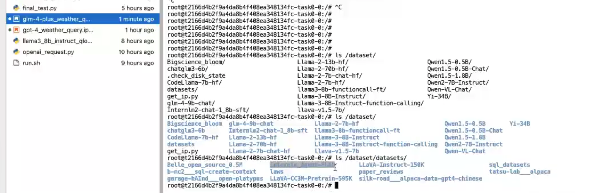

# Agent原理图

# 用国产大模型结合FunctionCalling扩展大模型能力

用智谱清言的GLM大模型。

- 模型位置: `/dataset/`

- 数据集位置:`/dataset/datasets`

modescope 阿里的国内大模型镜像源，它也是一个python库，安装之后可以直接下载想要的国内模型。

所以作业就是，把智谱清言的大模型下载到 超算平台的机器上。

又发现一个新词儿，aotugen。

使用国产大模型结合 functionCalling，执行效率很低。此时可以利用一个叫做Agent-Flan的数据集提升它调用function tools的能力。

作业：
注册一个国内大模型，得到apiKey，然后用它来做functionCalling试验。

在超算平台上部署一个glm大模型，然后用他来调用functionCalling，发现很慢，于是可以利用 模型微调，来对它进行优化，使得它的速度变快，并且能够给出正确的结果。

