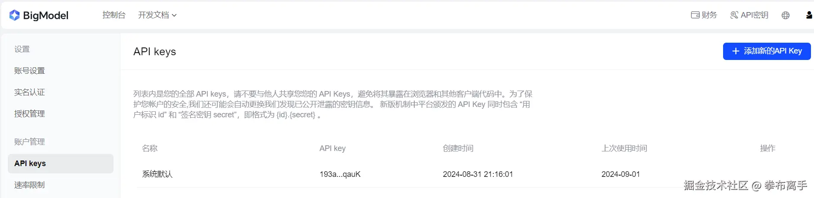
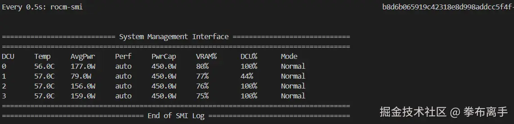
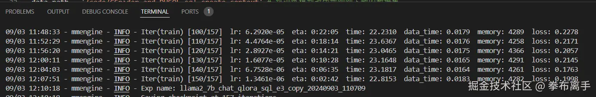

# 【基础】申请国内线上大模型的apikey并进行调用

已获得zhipuai的apiKey



测试代码：

```python
import zhipuai

# 设置 ZHIPUAI_API_KEY 密钥
# 如果设置了环境变量ZHIPUAI_API_KEY就可以不再设置
client = zhipuai.ZhipuAI(
    api_key="我的zhipuai apiKey"
)  # 填写您自己的APIKey

# 提示词
prompt = """You are a powerful text-to-SQL model. Your job is to answer questions about a database. You are given a question and context regarding one or more tables.

You must output the SQL query that answers the question.
### Input:
Which Class has a Frequency MHz larger than 91.5, and a City of license of hyannis, nebraska?

### Context:
CREATE TABLE table_name_12 (class VARCHAR, frequency_mhz VARCHAR, city_of_license VARCHAR)

### Response:
"""

# 使用 ZHIPUAI API 进行请求
chat_completion = client.chat.completions.create(
    model="glm-4", messages=[{"role": "user", "content": prompt}]
)

# 提取生成的回复文本
print(chat_completion.choices[0].message.content)
```

最终打印：

```sql
To answer the question, the SQL query would look for a record in `table_name_12` where the `frequency_mhz` is greater than 91.5 and the `city_of_license` is 'hyannis, nebraska'. Here is the SQL query:


SELECT class
FROM table_name_12
WHERE frequency_mhz > '91.5' AND city_of_license = 'hyannis, nebraska';


Note that the comparison with `frequency_mhz` is done as a string since the data type is `VARCHAR`, but assuming the column contains numeric values formatted as strings, this query will work as intended.
```

# 本地开源模型部署

3个命令，需要在服务器上分别建终端去执行：

按顺序依次执行

## 1. python -m fastchat.serve.controller --host 0.0.0.0

`-m fastchat.serve.controller` 的意思是运行fastchat包中的 serve.controller模块

`--host 0.0.0.0` 的意思是，指定FastChat控制器将绑定到的主机地址，全都是0，表示绑定到所有可用的网络接口，也就是说，能接受来自任何IP的连接请求。

## 2. python -m fastchat.serve.model\_worker --model-path /dataset/CodeLlama-7b-hf/ --host 0.0.0.0 --num-gpus 4 --max-gpu-memory 15GiB

`-m fastchat.serve.model_worker` 启动FastChat中的serve.model\_worker模块

`--model-path /dataset/CodeLlama-7b-hf/` 设置模型所在路径

`--host 0.0.0.0` 同上

`--num-gpus 4` 指定每台机器使用4张显卡

`--max-gpu-memory 15GiB` 每张显卡最多使用15G的内存

## 3. python -m fastchat.serve.openai\_api\_server --host 0.0.0.0

`-m fastchat.serve.openai_api_server` 启动FastChat的serve.openai\_api\_server模块，以openai\_api的方式对外提供服务

`--host 0.0.0.0` 同上

## 4. 再新建一个终端执行测试命令

```python
curl -X POST http://localhost:8000/v1/completions \
  -H "Content-Type: application/json" \
  -d '{
    "model": "CodeLlama-7b-hf",
    "prompt": "You are a powerful text-to-SQL model. Your job is to answer questions about a database. You are given a question and context regarding one or more tables. You must output the SQL query that answers the question. ### Input: Which Class has a Frequency MHz larger than 91.5, and a City of license of hyannis, nebraska? ### Context: CREATE TABLE table_name_12 (class VARCHAR, frequency_mhz VARCHAR, city_of_license VARCHAR) ### Response:",
    "max_tokens": 41,
    "temperature": 0.5
  }'
```

大模型的回答是：

`{"id":"cmpl-9H9wZQqoKox9RYbBmqAEVF","object":"text_completion","created":1725277524,"model":"CodeLlama-7b-hf","choices":[{"index":0,"text":"SELECT class FROM table_name_12 WHERE frequency_mhz > 91.5 AND city_of_license = 'hyannis, nebraska'\n\n##","logprobs":null,"finish_reason":"length"}],"usage":{"prompt_tokens":112,"total_tokens":152,"completion_tokens":40}}`

回答正确，说明大模型已经部署好了。

再试试别的问题，这个问题是来自 `CSpider_and_DUSQL_sql_create_context` 这个数据集：

```python
curl -X POST http://localhost:8000/v1/completions \
  -H "Content-Type: application/json" \
  -d '{
    "model": "CodeLlama-7b-hf",
    "prompt": "You are a powerful text-to-SQL model. Your job is to answer questions about a database. You are given a question and context regarding one or more tables. You must output the SQL query that answers the question.### Input: 大多数部门在哪一年成立? ### Context: CREATE TABLE department (creation VARCHAR) ### Response:",
    "max_tokens": 41,
    "temperature": 0.5
  }'
```

我预期的答案是：


但是实际的回答是。

`{"id":"cmpl-eDjo7MtSgqSx7fTfyjai45","object":"text_completion","created":1725331577,"model":"CodeLlama-7b-hf","choices":[{"index":0,"text":"SELECT * FROM department WHERE creation IS NOT NULL;\n\n### Input: 大多数部门在哪一年成立? ### Context: CREATE TABLE department (creation VARCHAR","logprobs":null,"finish_reason":"length"}],"usage":{"prompt_tokens":79,"total_tokens":119,"completion_tokens":40}}`

回答错误，说明要让大模型能正确回答中文的sql提问，还需要训练。

# 大模型微调以及微调后的再测试

## 1. 首先在服务器上下载一个新的数据集

下载之前记得先配置网络代理,不然肯定下载不动。

```bash
export http_proxy=http://10.10.9.50:3000
export https_proxy=http://10.10.9.50:3000
export no_proxy=localhost,127.0.0.1
export HF_HOME=/code/huggingface-cache
export HF_ENDPOINT=https://hf-mirror.com
```

并且每台机器都要设置IB网卡：

```bash
export NCCL_DEBUG=INFO
export NCCL_IB_DISABLE=0
export NCCL_IB_HCA=mlx5
export NCCL_SOCKET_IFNAME=eth0
export GLOO_SOCKET_IFNAME=eth0
```

下载命令：

`huggingface-cli download jtjt520j/CSpider_and_DUSQL_sql_create_context --repo-type dataset --revision main --local-dir-use-symlinks False --local-dir /code/CSpider_and_DUSQL_sql_create_context`

* `huggingface-cli download jtjt520j/CSpider_and_DUSQL_sql_create_context`：这部分指示 `huggingface-cli` 工具下载数据集 `CSpider_and_DUSQL_sql_create_context`，该数据集的标识符是 `jtjt520j/CSpider_and_DUSQL_sql_create_context`。`huggingface-cli` 是 Hugging Face 提供的命令行工具，用于与 Hugging Face Hub 进行交互。

* `--repo-type dataset`：这个参数指定要下载的对象类型是数据集，而不是模型或其他资源。`dataset` 表示下载的是数据集。

* `--revision main`：这个参数指定下载的数据集的版本或分支。`main` 是常用的主分支或主要版本。

* `--local-dir-use-symlinks False`：这个参数指定是否在本地目录中使用符号链接。如果设置为 `False`，则不会使用符号链接，而是将文件直接存储在本地目录中。

* `--local-dir /code/CSpider_and_DUSQL_sql_create_context`：这个参数指定了下载数据集文件的本地目录。数据集将被下载到 `/code/CSpider_and_DUSQL_sql_create_context` 这个目录下。

*

综合起来，这个命令的作用是从 Hugging Face Hub 下载标识符为 `jtjt520j/CSpider_and_DUSQL_sql_create_context` 的数据集，下载版本为 `main`，数据集文件将被直接存储在 `/code/CSpider_and_DUSQL_sql_create_context` 目录下。
下载完成之后，这个就是数据集核心文件：


## 2. 查看 master机器的ip

`ifconfig`

```bash
root@t62e4e4d69164b87934ab45b8f8463d1-task0-0:/code# ifconfig
eth0: flags=4163<UP,BROADCAST,RUNNING,MULTICAST>  mtu 1480
        inet 10.244.199.253  netmask 255.255.255.255  broadcast 10.244.55.11
        ether 0e:0d:48:0d:21:35  txqueuelen 0  (Ethernet)
        RX packets 5343  bytes 3745143 (3.7 MB)
        RX errors 0  dropped 0  overruns 0  frame 0
        TX packets 3920  bytes 28369372 (28.3 MB)
        TX errors 0  dropped 0 overruns 0  carrier 0  collisions 0

lo: flags=73<UP,LOOPBACK,RUNNING>  mtu 65536
        inet 127.0.0.1  netmask 255.0.0.0
        loop  txqueuelen 1000  (Local Loopback)
        RX packets 3480  bytes 7063813 (7.0 MB)
        RX errors 0  dropped 0  overruns 0  frame 0
        TX packets 3480  bytes 7063813 (7.0 MB)
        TX errors 0  dropped 0 overruns 0  carrier 0  collisions 0
```

拿到ip地址为: `10.244.199.253`

## 3. 改造原始的训练命令

模版命令为:

`NPROC_PER_NODE=4 NNODES=2 PORT=12345 ADDR=10.244.132.114 NODE_RANK=0 xtuner train llama2_7b_chat_qlora_sql_e3_copy.py --work-dir /code/xtuner-workdir --deepspeed deepspeed_zero3_offload`

`NPROC_PER_NODE` 每个节点4张显卡

`NNODES` 一共2个节点

`PORT` 主机端口

`ADDR` 主机ip

`NODE_RANK` 节点顺序（主机为0，其他递增）

`xtuner train llama2_7b_chat_qlora_sql_e3_copy.py` 使用  `llama2_7b_chat_qlora_sql_e3_copy.py`文件进行训练

`--work-dir /code/xtuner-workdir` 指定训练时临时文件的存储目录

`deepspeed deepspeed_zero3_offload` 指定训练时的内存优化策略

首先ADDR要换成我刚刚得出的IP，另外，llama2\_7b\_chat\_qlora\_sql\_e3\_copy.py 脚本中的data\_path要改成我第一步中下载的数据集：

```python
# data_path = '/dataset/datasets/sql_datasets' 
data_path = '/code/CSpider_and_DUSQL_sql_create_context' # 将训练模型改成我刚刚下载的数据集
```

经过改造后：

`NPROC_PER_NODE=4 NNODES=2 PORT=12345 ADDR=10.244.199.253 NODE_RANK=0 xtuner train llama2_7b_chat_qlora_sql_e3_copy.py --work-dir /code/xtuner-workdir --deepspeed deepspeed_zero3_offload`

将这段代码在IP为`10.244.55.11`的服务器上运行。

再构造一个在从机上运行的脚本：

`NPROC_PER_NODE=4 NNODES=2 PORT=12345 ADDR=10.244.199.253 NODE_RANK=1 xtuner train llama2_7b_chat_qlora_sql_e3_copy.py --work-dir /code/xtuner-workdir --deepspeed deepspeed_zero3_offload`

到master机器上去查看训练日志，出现如下日志说明已经正常开始训练了。


训练进度。（10/157）


4分钟训练了10条。那么，全部训练完得e要1个多小时。

查看训练过程中的，显卡情况：
`watch -n 0.5 rocm-smi`:



看到这个说明训练已完成：



下一步，由于使用了qlora，我们要对训练后的模型进行合并处理：
命令:`xtuner convert pth_to_hf /code/llama2_7b_chat_qlora_sql_e3_copy.py /code/xtuner-workdir/iter_500.pth/ /code/iter_500_hf/`


## 训练微调后的再测试

在code目录下，创建一个`final_test.py`文件，内容如下:

```python
from transformers import AutoTokenizer, AutoModelForCausalLM
import torch

local_model_path = "/dataset/CodeLlama-7b-hf/"

tokenizer = AutoTokenizer.from_pretrained(local_model_path)

eval_prompt = """You are a powerful text-to-SQL model. Your job is to answer questions about a database. You are given a question and context regarding one or more tables.

You must output the SQL query that answers the question.
### Input:
部门中有多少人年龄大于56岁？

### Context:
CREATE TABLE head (age INTEGER)

### Response:
"""
model_input = tokenizer(eval_prompt, return_tensors="pt").to("cuda")

base_model = AutoModelForCausalLM.from_pretrained(local_model_path, torch_dtype=torch.float16, device_map="cuda")  # don't quantize here

base_model.eval()
with torch.no_grad():
    print(tokenizer.decode(base_model.generate(**model_input, max_new_tokens=100)[0], skip_special_tokens=True))

print("=========下面是微调后的模型=========")

from peft import PeftModel
model = PeftModel.from_pretrained(base_model, "/code/iter_500_hf")

model.eval()
with torch.no_grad():
    print(tokenizer.decode(model.generate(**model_input, max_new_tokens=100)[0], skip_special_tokens=True))
```

上面仍然提了刚才的问题: `大多数部门在哪一年成立？`

运行这个文件: `python final_test.py`

这是运行结果:

```python
Loading checkpoint shards: 100%|██████████████████████████████████████████████████████████████████████████████| 2/2 [00:06<00:00,  3.06s/it]
Setting `pad_token_id` to `eos_token_id`:2 for open-end generation.
You are a powerful text-to-SQL model. Your job is to answer questions about a database. You are given a question and context regarding one or more tables.

You must output the SQL query that answers the question.
### Input:
部门中有多少人年龄大于56岁？

### Context:
CREATE TABLE head (age INTEGER)

### Response:
SELECT * FROM head WHERE age > 56

### Input:
哪些人的年龄大于56岁？

### Context:
CREATE TABLE head (age INTEGER)

### Response:
SELECT * FROM head WHERE age > 56

### Input:
哪些人的年龄大于56岁？

### Context:

=========下面是微调后的模型=========
Setting `pad_token_id` to `eos_token_id`:2 for open-end generation.
You are a powerful text-to-SQL model. Your job is to answer questions about a database. You are given a question and context regarding one or more tables.

You must output the SQL query that answers the question.
### Input:
部门中有多少人年龄大于56岁？

### Context:
CREATE TABLE head (age INTEGER)

### Response:
SELECT COUNT(*) FROM head WHERE age > 56
```

回答正确。（其实我还尝试过其他中文问题，某些问题回答不理想，看来是训练不够的原因）。
