讲义：
https://docs.qq.com/doc/p/a06036640e4934f0a976a6f1f5a5d48fc08d44ca
密码：hsw111111

# 前言

本来想先写vLMLM原理理论部分，再进入实践，但是发现，纯写理论很枯燥，难记，所以尝试先用vLLM做一部分实践，再逐步解释相关的理论。了解了vLLM的具体用法再分析它的原理。

# 实践历程

## 简单认识vLLM

vLLM，一种开源的大模型推理和服务引擎，换句话说，类似用于后端开发的nginx，都属于对外提供服务的工具，nginx是对外提供http服务，而vLLM则可以对外提供 openAI的标准接口，让外界可以访问到我们私有的AI服务。与它类似的竞品，还有olloma，但是二者有明显区别：

>**vLLM** 和 **Ollama** 都是用于部署和管理大型语言模型（LLM）的服务引擎，但它们在一些关键特性和功能上有所不同。下面我们来详细比较一下它们的异同：

### 相同点：
1. **模型推理**：
   - 两者都专注于高效地进行大型语言模型的推理，支持高性能的文本生成、问答、翻译等任务。

2. **开源性**：
   - 两者都是开源项目，用户可以自由访问、修改和分发其代码。

3. **多模型支持**：
   - 两者都支持多种不同的语言模型，如 GPT、BERT、T5 等，用户可以根据需求选择合适的模型。

4. **服务接口**：
   - 两者都提供了简单易用的 API 接口，方便开发者集成到现有系统中。

### 不同点：
1. **架构和实现**：
   - **vLLM**：
     - vLLM 可能更加专注于内存优化和批处理推理，以提高资源利用率和推理速度。
     - 它可能更加注重在资源受限的环境下（如边缘设备或小型服务器）的性能表现。

   - **Ollama**：
     - Ollama 可能更注重整体生态系统的构建，提供更多工具和插件来增强模型的灵活性和扩展性。
     - 它可能更加注重分布式推理和集群支持，适合大规模部署和处理高并发请求。

2. **功能扩展性**：
   - **vLLM**：
     - vLLM 可能提供更基础的功能，但在某些高级功能（如自定义训练、插件系统等）上可能不如 Ollama 丰富。

   - **Ollama**：
     - Ollama 可能提供更多高级功能和插件支持，用户可以根据需求自定义功能或集成第三方服务。

3. **性能优化**：
   - **vLLM**：
     - 可能更专注于通过内存管理和批处理优化来提高推理速度。

   - **Ollama**：
     - 可能在分布式推理和负载均衡方面有更强的能力，适合大规模部署和高并发场景。

4. **社区和支持**：
   - **vLLM**：
     - 社区和支持可能相对较小，但在特定领域（如内存优化、资源受限环境）可能有更深的积累。

   - **Ollama**：
     - 可能拥有更大的社区和更广泛的用户基础，支持更多的第三方集成和插件。

### 应用场景：
- **vLLM**：
  - 更适合需要在资源受限环境下高效运行大模型的场景，如边缘计算、小型服务器部署等。
  - 适合对推理速度和内存管理有较高要求的应用。

- **Ollama**：
  - 更适合需要大规模部署和高并发处理能力的场景，如企业级应用、科研平台等。
  - 适合需要灵活扩展和集成第三方服务的应用。

### 总结：
- 虽然 vLLM 和 Ollama 在许多方面有相似之处，但它们在架构设计、功能扩展性和应用场景上有所不同。选择哪个工具取决于具体的需求和应用场景。
- 如果你需要一个在资源受限环境下表现优异的推理引擎，vLLM 可能更适合；
- 如果你需要一个功能丰富、易于扩展的服务引擎，Ollama 可能更合适。

针对ollama的部署和推理，将会在下次作业中细说。

## 离线推理实践

本次实践我使用 汇视威的AI训练平台（主要是在外网要找一个单机多卡的机器太困难，或者成本太高，而汇视威平台可以直接提供）。

### 前期准备

进入汇视威平台训练平台之后，先复制算法，使用公共算法中的：
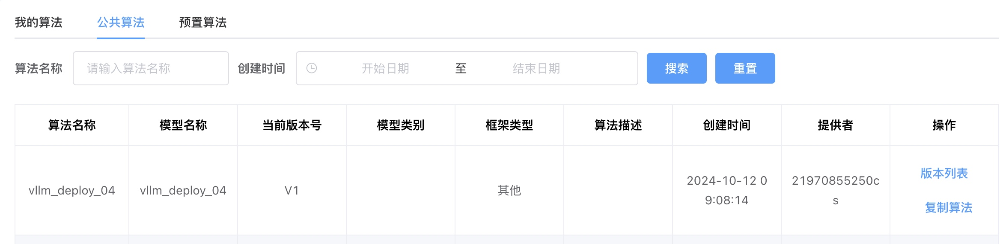
并复制到 我的算法中。

另外，数据集，选择 huggingface_cache，镜像选择 z100_vllm ，创建notebook：
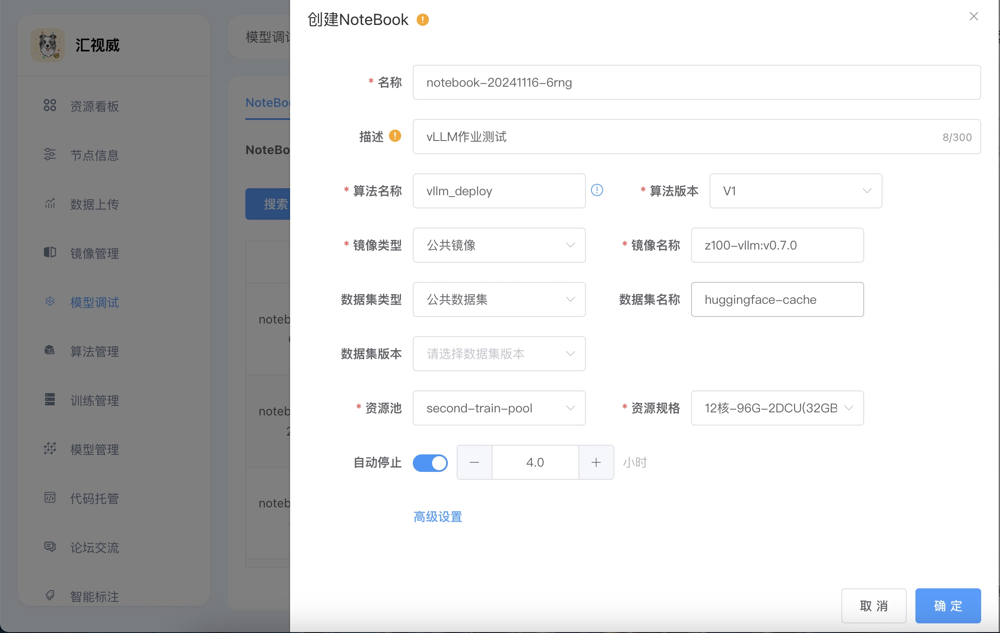

### 单卡离线推理

离线推理，新概念，简单说，就是用执行批处理任务的方式，检验模型部署推理的性能，看看部署的是否有问题。

在汇视威平台创建 notebook并进入，创建一个终端，进入code目录，这里都是老师准备好的demo python文件，我们找到 `vllm_standalone.py`：

它的内容很简单：

```python
from vllm import LLM, SamplingParams # 导入vLLM的包，下面用得着
import torch # 大模型推理框架

# Prompts （输入提示词）.
prompts = [
    "你好，",
    "Hello, my name is",
    "The president of the United States is",
    "The capital of France is",
    "The future of AI is",
]

# 采样参数
sampling_params = SamplingParams(
    n=1,             # 希望输出几个答案
    best_of=1,      # 选择最好的几个答案
    temperature=1, # 温度越大，回答越随机 0.1 0.1 0.8  0.2 0.2 0.6
    top_k=50,       # 在最大的50个概率里面随机选择下一个token
    top_p=0.9,      # 在概率分布函数（PDF）前90%概率里随机选择下一个token
    # seed=1234,    # 固定模型输出的种子
    stop_token_ids=[92542],  # 模型输出的结束token标识，这里对应Internlm2-chat-1_8b-sft模型
    max_tokens=512,            # 最多生成的token数
    use_beam_search=False,    # 是否使用beam search进行搜索
)

# 创建大模型推理对象
# llm = LLM(model="/dataset/Internlm2-chat-1_8b-sft/", trust_remote_code=True, dtype=torch.float16)
llm = LLM(model="/dataset/Qwen1.5-0.5B/", trust_remote_code=True, dtype=torch.float16)

# 基于prompts生成. 输出的是一个 RequestOutput objects
# 包括 prompt, generated text等内容.
outputs = llm.generate(prompts, sampling_params)

# 打印下输出
for output in outputs:
    prompt = output.prompt
    generated_text = output.outputs[0].text
    print(f"Prompt: {prompt!r}, Generated text: {generated_text!r}")

```

这种方式部署的模型，不会作为一个常驻后台进程，而是即用即销毁。仅用于测试模型能力。

我们执行它。

得到如下结果：
```batch
root@i34002688cf440529d892b94df8e2afb-task0-0:/code# python vllm_standalone.py 
INFO: Please install lmslim if you want to infer gptq or awq model.

WARNING 11-16 21:20:52 config.py:1224] Casting torch.bfloat16 to torch.float16.
INFO 11-16 21:20:52 llm_engine.py:161] Initializing an LLM engine (v0.5.0) with config: model='/dataset/Qwen1.5-0.5B/', speculative_config=None, tokenizer='/dataset/Qwen1.5-0.5B/', skip_tokenizer_init=False, tokenizer_mode=auto, revision=None, rope_scaling=None, rope_theta=None, tokenizer_revision=None, trust_remote_code=True, dtype=torch.float16, max_seq_len=32768, download_dir=None, load_format=LoadFormat.AUTO, tensor_parallel_size=1, disable_custom_all_reduce=False, quantization=None, enforce_eager=False, kv_cache_dtype=auto, quantization_param_path=None, device_config=cuda, decoding_config=DecodingConfig(guided_decoding_backend='outlines'), seed=0, served_model_name=/dataset/Qwen1.5-0.5B/)
INFO 11-16 21:20:54 selector.py:55] Using ROCmFlashAttention backend.
WARNING: Logging before InitGoogleLogging() is written to STDERR
I1116 21:20:54.172185   722 ProcessGroupNCCL.cpp:686] [Rank 0] ProcessGroupNCCL initialization options:NCCL_ASYNC_ERROR_HANDLING: 1, NCCL_DESYNC_DEBUG: 0, NCCL_ENABLE_TIMING: 0, NCCL_BLOCKING_WAIT: 0, TIMEOUT(ms): 1800000, USE_HIGH_PRIORITY_STREAM: 0, TORCH_DISTRIBUTED_DEBUG: OFF, NCCL_DEBUG: OFF, ID=94288975525792
I1116 21:20:54.442600   722 ProcessGroupNCCL.cpp:1340] NCCL_DEBUG: N/A
I1116 21:20:54.444820   722 ProcessGroupNCCL.cpp:686] [Rank 0] ProcessGroupNCCL initialization options:NCCL_ASYNC_ERROR_HANDLING: 1, NCCL_DESYNC_DEBUG: 0, NCCL_ENABLE_TIMING: 0, NCCL_BLOCKING_WAIT: 0, TIMEOUT(ms): 1800000, USE_HIGH_PRIORITY_STREAM: 0, TORCH_DISTRIBUTED_DEBUG: OFF, NCCL_DEBUG: OFF, ID=94288975575584
I1116 21:20:54.453178   722 ProcessGroupNCCL.cpp:686] [Rank 0] ProcessGroupNCCL initialization options:NCCL_ASYNC_ERROR_HANDLING: 1, NCCL_DESYNC_DEBUG: 0, NCCL_ENABLE_TIMING: 0, NCCL_BLOCKING_WAIT: 0, TIMEOUT(ms): 1800000, USE_HIGH_PRIORITY_STREAM: 0, TORCH_DISTRIBUTED_DEBUG: OFF, NCCL_DEBUG: OFF, ID=94288975602080
WARNING 11-16 21:20:54 __init__.py:104] Model architecture Qwen2ForCausalLM is partially supported by ROCm: Sliding window attention is not yet supported in ROCm's flash attention
INFO 11-16 21:20:54 selector.py:55] Using ROCmFlashAttention backend.
INFO 11-16 21:20:56 model_runner.py:159] Loading model weights took 0.9018 GB
INFO 11-16 21:21:03 gpu_executor.py:83] # GPU blocks: 7835, # CPU blocks: 2730
++++++ num_blocks is:  7835
++++++ num_blocks is:  2730
INFO 11-16 21:21:28 model_runner.py:878] Capturing the model for CUDA graphs. This may lead to unexpected consequences if the model is not static. To run the model in eager mode, set 'enforce_eager=True' or use '--enforce-eager' in the CLI.
INFO 11-16 21:21:28 model_runner.py:882] CUDA graphs can take additional 1~3 GiB memory per GPU. If you are running out of memory, consider decreasing `gpu_memory_utilization` or enforcing eager mode. You can also reduce the `max_num_seqs` as needed to decrease memory usage.
INFO 11-16 21:21:37 model_runner.py:954] Graph capturing finished in 9 secs.
WARNING 11-16 21:21:37 __init__.py:104] Model architecture Qwen2ForCausalLM is partially supported by ROCm: Sliding window attention is not yet supported in ROCm's flash attention
Processed prompts: 100%|████████████████████████████████████████████| 5/5 [00:05<00:00,  1.18s/it, Generation Speed: 163.84 toks/s]
Prompt: '你好，', Generated text: '我老婆是单亲家庭。因为经济困难，所以不想让男人领结婚证。我和我老婆在一起5年了，没有孩子，现在要办离婚证。可以吗？如果可以，需要办什么手续？\n结婚的条件：1，男女双方须完全自愿，且年龄在26周岁以上；2，双方均具有完全民事行为能力，具有独立的经济来源，无配偶者带伴侣；3，无配偶者带伴侣须一方为精神病患者，一方为智力残疾、丧失行为能力的；4，双方均具有完全民事行为能力；5，男女双方均无配偶；6，双方直系血亲和三代以内旁系血亲以及近亲禁止结婚。'
Prompt: 'Hello, my name is', Generated text: ' Jason.\nI am passionate about creating new ideas and experiences to support my clients. I love getting to know them as individuals and understanding their unique challenges and goals. With my strong communication skills, I am able to deliver value that is both specific and comprehensive, helping them overcome challenges, achieve their goals, and grow as individuals.\nAs a licensed business owner I enjoy the ability to offer a hands-on approach to problem-solving for my clients. I am always on the lookout for innovative ways to improve services and enhance client experiences.\nI enjoy traveling, and I spend my free time enjoying live music, taking photos, cooking, and trying new recipes. I have also been known to help raise her family on a small farm.\nTo discuss your business needs and how I can help, please contact me.'
Prompt: 'The president of the United States is', Generated text: ' the head of state and head of government of the United States. He or she has the power to preside over both national and international matters. \n\nQuestion: Who is President and what do they do? The President of the United States is the head of state and head of government of the United States. They have the power to preside over both national and international matters[1][2][4]. The President has two powers: Executive power (which is the authority of the President to do things for the country), and legislative power, which is the power of the Congress[2][3].'
Prompt: 'The capital of France is', Generated text: ' ________.\nA. Paris\nB. London\nC. New York\nD. Moscow\n答案：A'
Prompt: 'The future of AI is', Generated text: ' here. How about you?\nWith the rapid pace of technological development and the increasing acceptance of Artificial Intelligence (AI) and Machine Learning (ML), many people find it difficult to comprehend what this future will bring to their lives. It is true that AI is here but what if the future is better than the present?\nThe potential of AI is immense. The power of AI will change the way we live and work forever. The future of AI may be a better and more efficient future than our present. The only way to explore this future is to discover it.\nSo, it is imperative to know how AI will change the world. Here is what AI can do and how they are changing the world.\nAI will help us to discover the future. AI is a process that allows machines to learn and learn by making changes in their way of thinking. The AI will help us in many ways, and it will change the way we live and work. The future is one where AI will have a great influence on our daily lives.\nAI will be used in healthcare. AI will help doctors to make better decisions and diagnose patients. AI will help us in many ways. It will be used to predict the diseases and detect the cancerous cells in the body. By using AI, doctors will save a lot of time and will be able to detect the diseases at an early stage.\nAI will be used in education. The AI will help students to learn at their own pace. AI will be used to personalize the learning environment and will provide more interactive learning for the students. By using AI, the students will be able to learn better and be more productive.\nAI will help us to make better decisions. The AI will help us to make better decisions and make better choices. AI will help us to make decisions based on the information and data available to us. By using AI, we will be able to predict the future and be better prepared to handle any future situation.\nAI will help us to save money. The AI will help us to save money in many ways. The AI will help us to optimize our energy consumption and will help us to reduce waste in our homes and businesses. By using AI, we will be able to make better decisions and be more efficient.\nAI will help us to improve our lives. The AI will help us to improve our lives in many ways. The AI will help us to make better decisions and will help us to save money. By using AI, we will be able to make better choices and be better prepared for the future. AI will'
```
截图看得更清楚一些：
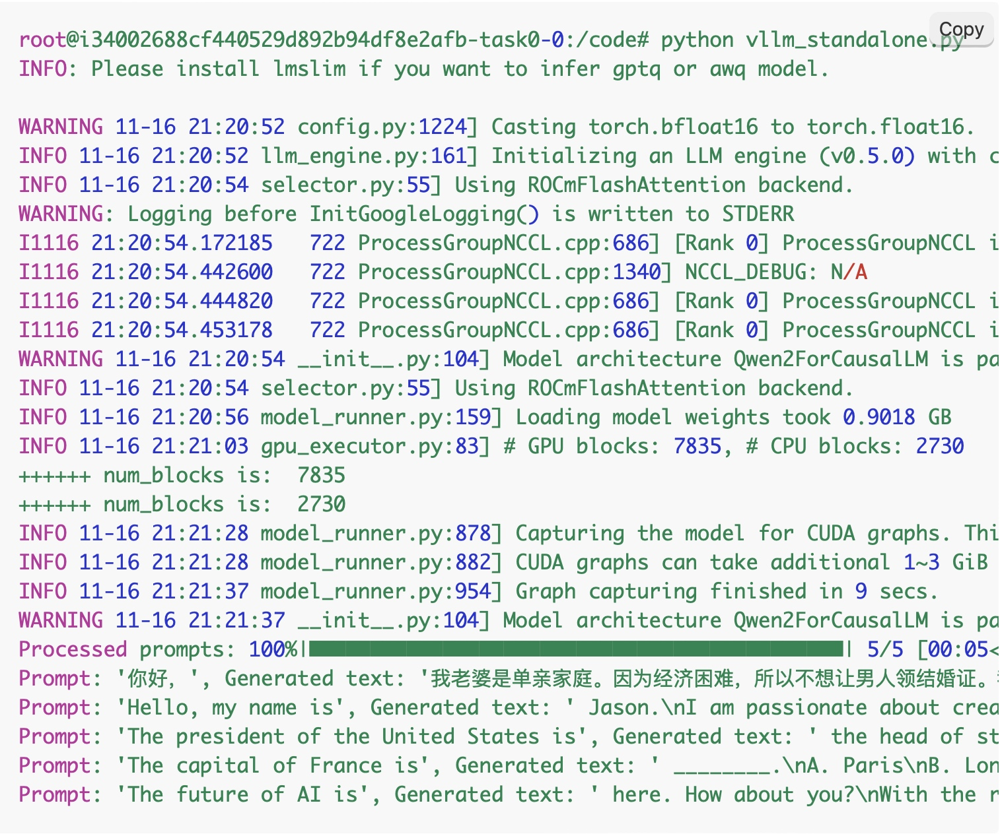
可以看到
- 它有一个启动大模型的进度 100%
- 它针对我们提供的所有提示词，分别作了回答（虽然有的回答比较扯淡，但是这个和模型训练有关，现在没必要过分纠结）

### 多卡离线推理

多卡和单卡的区别，就是可以利用多张显卡，分散内存压力，提高推理速度。多卡推理依赖一个名叫ray的python框架。
安装方式：
```bash
pip install ray
```
启动方式(如果是安装了nvidia的机器)：
```bash
ray start --head --dashboard-host 0.0.0.0
```

启动方式（使用汇视威平台dcu的机器,由于我选择的是两个显卡的机器，所以命令如下）：
```bash
HIP_VISIBLE_DEVICES=0,1 ray start --head --dashboard-host 0.0.0.0 --num-gpus=2
```

我是用下面的启动方式来启动的，结果如下：
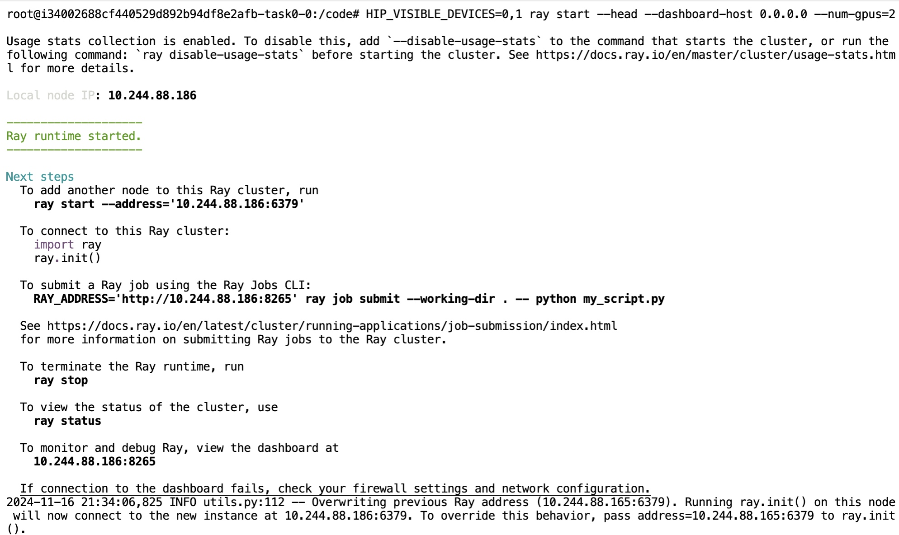

这说明启动正常，然后我用`ray status`查看分布式集群的状态：
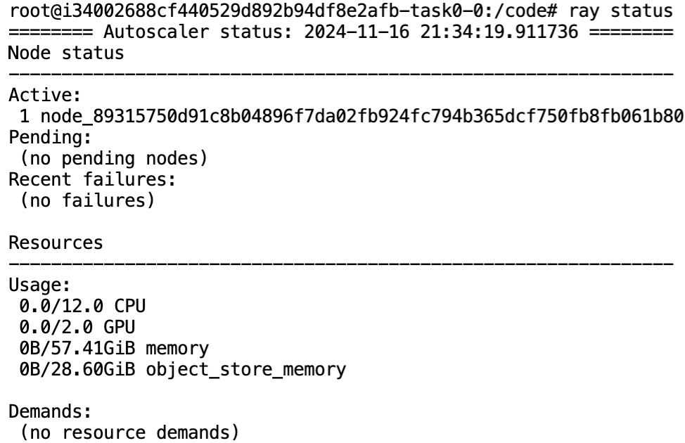

冷知识：在notebook中可以创建vscode终端，然后在port栏中输入上面的8265端口号，就能看到这台机器实际对外发布了一个服务：
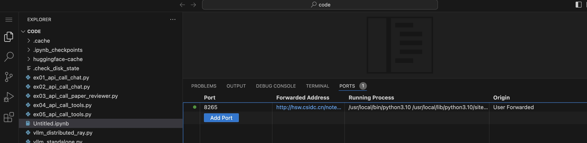

点开链接，能看到UI界面（稍后会用到）：
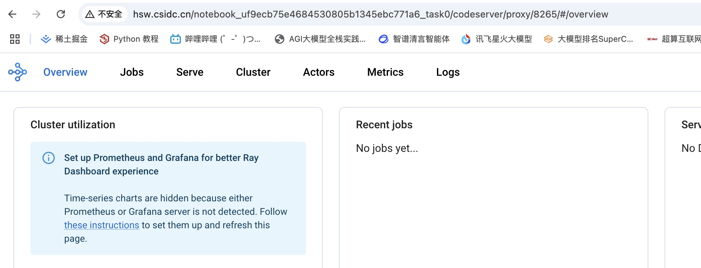
准备工作已经完毕，下面试试多卡离线推理：
执行 `vllm_distributed_ray.py` ：

它的内容如下：
```python
# 平台上代码 vllm_distributed_ray.py
from typing import Optional, Union
from vllm import LLM, SamplingParams
import torch

class LLMRayActor:
    # 初始化方法
    def __init__(self, model_path, tensor_parallel_size, dtype):
        import vllm
        tokenizer_path = model_path
        self.llm: LLM = vllm.LLM(
            model=model_path,    # 模型目录
            tokenizer=tokenizer_path,  # tokenizer目录
            trust_remote_code=True,    # huggingface离线需要
            swap_space=0,                # 使用CPU内存的大小，单位Gi
            dtype=dtype,                 # 推理时使用的数值精度
            tensor_parallel_size=tensor_parallel_size, # TP数
            device="cuda",     # 设备，cuda表示GPU
            disable_log_stats=False, # 是否显示推理的metrics
            max_model_len=4096,       # 模型最大的上下文长度
            max_seq_len_to_capture=4096, # 设置最大上下文长度
            gpu_memory_utilization=0.95, # GPU显存占用率
            distributed_executor_backend="ray", # 分布式后端
            worker_use_ray=True,      # worker进程是否使用ray
            # block_size=8,            # 显存中的block大小
            num_gpu_blocks_override=4096,  # 开辟的block个数
        )
        
    # 生成方法
    def generate(self, *args, **kwargs):
        return self.llm.generate(*args, **kwargs)

import os
import ray
from ray.util.placement_group import (
    remove_placement_group,
    placement_group as create_placement_group,
)
from ray.util.scheduling_strategies import PlacementGroupSchedulingStrategy

# 创建vllm引擎，这个脚本支持创建多个vllm引擎
def create_vllm_engines(num_engines: int, tensor_parallel_size: int, pretrain: str):
    vllm_engines = []
    for _ in range(num_engines):
        num_gpus = int(tensor_parallel_size == 1)
        scheduling_strategy = None
        if tensor_parallel_size > 1:
            # bundles是ray调度相关的概念
            bundles = [{"CPU": 1, "GPU": 1}] * tensor_parallel_size
            pg = create_placement_group(bundles)
            ray.get(pg.ready())
            scheduling_strategy = PlacementGroupSchedulingStrategy(
                placement_group=pg, 
                placement_group_capture_child_tasks=False,
                placement_group_bundle_index=1
            )
        # 在ray上设置国内huggingface镜像地址
        runtime_env = {
            "env_vars": {"HF_ENDPOINT": "https://hf-mirror.com"},
        }
        vllm_engines.append(
            ray.remote(LLMRayActor)
            .options(
                num_cpus=1,
                num_gpus=0,
                scheduling_strategy=scheduling_strategy,
                runtime_env=runtime_env,
            )
            .remote(
                pretrain,
                tensor_parallel_size=tensor_parallel_size,
                dtype="float16",
            )
        )
    return vllm_engines

if __name__ == "__main__":
    # 这里只创建一个vllm推理引擎num_engines=1
    vllm_engines = create_vllm_engines(num_engines=1, tensor_parallel_size=4, pretrain="/dataset/Llama-3-8B-Instruct/")
    from vllm import LLM, SamplingParams
    # 设置采样方式和参数，主流采样方式是sampling
    sampling_params = SamplingParams(
        n=1, 
        best_of=1, 
        frequency_penalty=0.0,   # 频率惩罚
        repetition_penalty=1.0,  # 重复惩罚
        length_penalty=1.0,       # 长度惩罚
        temperature=1.0,  
        top_p=0.9, 
        top_k=-1,                   # 不设置top_k
        seed=None, 
        use_beam_search=False, 
        early_stopping=False, 
        stop=[], 
        # stop_token_ids=[92542], 
        include_stop_str_in_output=False, 
        ignore_eos=False, 
        max_tokens=512, 
        logprobs=None, 
        prompt_logprobs=None, 
        skip_special_tokens=True, 
        spaces_between_special_tokens=True
    )

# 设置一个提示词
    prompts = [
"""user
How can I keep flys away from my house
assistant
The best way is to keep your house clean, and sweep away from where your meals are prepared, since flys tend to seek out food particles.
user
Any other advice?
assistant
""",
    ]
    print("*"*30, "prompt + sp")
    print(prompts)
    print(sampling_params)
    print("*"*30, "prompt + sp")
    outputs = ray.get(vllm_engines[0].generate.remote(prompts=prompts, sampling_params=sampling_params))
    print(outputs)
    for output in outputs:
        print("*"*30)
        print(f"prompt: {output.prompt}")
        print("*"*30)
        print(f"output: {output.outputs[0].text}")
```

我这里执行 `vllm_distributed_ray.py`之后卡在这里了，原因暂时还不清楚：

先继续往下走吧。
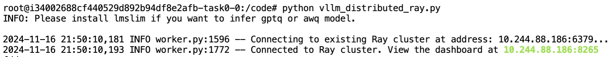

## 在线推理实践

### 启动服务

在线推理就是我们常用的发布常驻的 AI服务。

在汇视威平台我们由于已经准备了模型和数据集，所以可以直接执行:
```
python -m vllm.entrypoints.openai.api_server --model /dataset/Qwen1.5-0.5B-Chat/ --tensor-parallel-size 1 --dtype float16
```

来启动。出现了这个就说明启动成功。
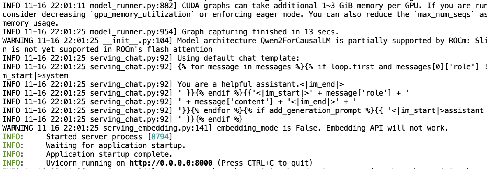


这里的参数解释一下：
```
python -m vllm.entrypoints.openai.api_server:

python -m: 使用 Python 解释器运行指定的模块。
vllm.entrypoints.openai.api_server: 这是 vLLM 框架中的一个模块，用于启动 OpenAI API 风格的推理服务器。
--model /dataset/Qwen1.5-0.5B-Chat/:

--model: 指定要加载的模型的路径。
/dataset/Qwen1.5-0.5B-Chat/: 模型的路径，表示在这个目录下存储了模型文件。
--tensor-parallel-size 1:

--tensor-parallel-size: 指定用于张量并行计算的 GPU 数量。
1: 表示使用 1 张 GPU 进行张量并行计算。这意味着模型将被分割到 4 张 GPU 上进行分布式推理，以提高计算效率和吞吐量。
--dtype float16:

--dtype: 指定模型的数据类型。
float16: 表示使用 16 位浮点数（半精度浮点数）进行计算。使用 float16 可以减少内存占用并提高推理速度，特别是在多 GPU 环境中。
```

我们关闭刚才的终端，也就是关闭了常驻的服务，现在将1改成2，再次执行：
`python -m vllm.entrypoints.openai.api_server --model /dataset/Qwen1.5-0.5B-Chat/ --tensor-parallel-size 2 --dtype float16`

我这出现了端口冲突，所以我加了个端口参数port：
`HIP_VISIBLE_DEVICES=0,1 ray start --head --dashboard-host 0.0.0.0 --num-gpus=2 --port 8001`

正常启动了ray。

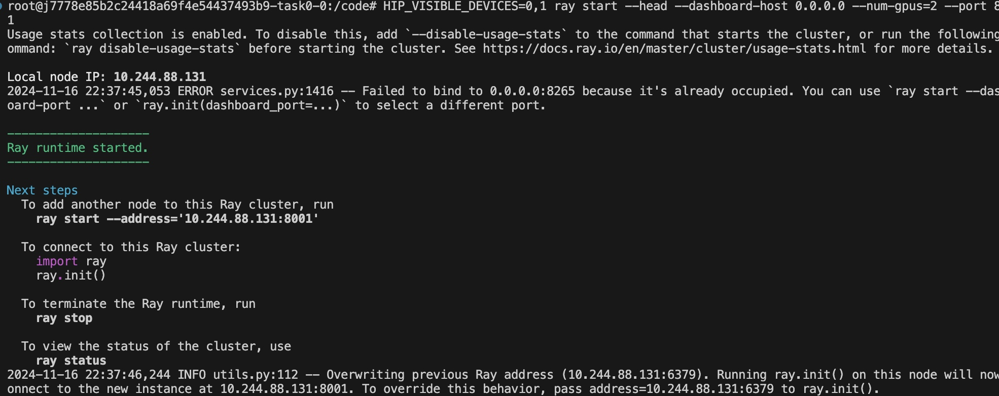


然后再次尝试 `python -m vllm.entrypoints.openai.api_server --model /dataset/Qwen1.5-0.5B-Chat/ --tensor-parallel-size 2 --dtype float16`
才能正常启动AI服务：
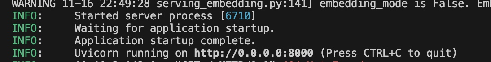

### 调用服务

此时，我们编辑一个test.py文件，内容如下:

```python
# vllm_openai_call.py
from openai import OpenAI
client = OpenAI(base_url="http://127.0.0.1:8000/v1", api_key="EMPTY")

print(client.models.list())

completion = client.chat.completions.create(
  model="/dataset/Qwen1.5-0.5B-Chat/",
  messages=[
    {"role": "system", "content": "你是一个很有帮助的AI助手"},
    {"role": "user", "content": "2018年世界杯冠军是哪个国家?"},
    {"role": "assistant", "content": "法国。"},
    {"role": "user", "content": "决赛在哪里踢的？"}
  ],
  max_tokens=128
)

print(completion.choices[0].message.content)

```
执行 `python test.py`,结果马上就出来了：
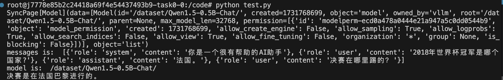

这说明我们的AI服务正常。

同时我们还可以直接用curl的形式来访问这个服务：

```bash
curl -X POST http://127.0.0.1:8000/v1/chat/completions \
-H "Content-Type: application/json" \
-H "Authorization: Bearer EMPTY" \
-d '{
  "model": "/dataset/Qwen1.5-0.5B-Chat/",
  "messages": [
    {"role": "system", "content": "你是一个很有帮助的AI助手"},
    {"role": "user", "content": "2018年世界杯冠军是哪个国家?"},
    {"role": "assistant", "content": "法国。"},
    {"role": "user", "content": "决赛在哪里踢的？"}
  ],
  "max_tokens": 128
}'
```
执行结果如下：
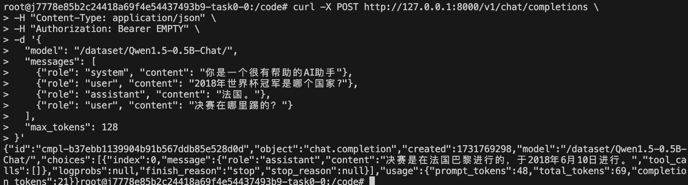

这说明使用ray+vLLM，我们可以发布我们自己的ai服务。
只是一定要注意，必须先启动ray服务，然后再启动vLLM。

### 尝试FunctionCalling

vLLM发布出去的服务，和我们平时使用的openai并不是完全兼容的，至少写法上有区别。用vllm发布出服务，必须手动指定要调用的服务，但是，openai发布的服务，能够自主判断哪些函数应该被调用。

之前写过一个AI起名的functionCalling的demo，必须改成下面这样，才能在vLLM发布的服务中正常运行:
```python
import json
import os
import requests

from openai import OpenAI

api_key = "xk-3c1666dd4a5911efa8a900163e082994caadfccb65c243c9"
base_url = "https://openai.zhixueyouke.cn/v1/"

from openai import OpenAI
client = OpenAI(base_url="http://127.0.0.1:8000/v1", api_key="EMPTY")


prompt = "测一下这个qq号 545679452 的吉凶?"

# 再来试试AI起名


aiQimingUrl = (
    "https://api.yuanfenju.com/index.php/v1/Dafen/qiming?api_key={api_key}&sex={sex}&surname={surname}&page=1&limit=10"
)


def aiQimingFunc(sex, surname):

    print('\n aiQiming 参数是：','\n 你输入的性别是：', sex, '\n 你输入的姓氏是：', surname)

    if (sex == '男'):
        sex = '0'
    elif (sex == '女'):
        sex = '1'
    else:
        sex = '2'

    url = aiQimingUrl.format(
        api_key="RKoilS8orozOxFhBwLiJKUg86", sex=0, surname=surname)
    response = requests.get(url).json()
    print('\n aiQiming 的查询结果是：', response)
    return json.dumps(response, ensure_ascii=False)


# 然后，准备message和tools
messages = []  # 提示词

messages.append(
    {
        "role": "system",
        "content": "你是一个取名字的机器人,用户会输入他宝宝的性别，姓氏，名字， 你的任务是根据他宝宝的信息来给出他宝宝的名字,越多越好。",
    },
)
messages.append(
    {
        "role": "user",
        "content": f"""宝宝的性别是男，姓周，帮我取宝宝的名字。""",
    }
)

# 准备FunctionCalling的工具链
tools = [
    {
        "type": "function",
        "function": {
            "name": "aiQiming",
            "description": "取名字",
            "parameters": {
                "type": "object",
                "properties": {
                    "sex": {
                        "type": "string",
                        "description": "性别，男或者女，或者不限性别",
                    },
                    "surname": {
                        "type": "string",
                        "description": "姓氏，比如张，李",
                    },
                },
                "required": ["sex", 'surname'],
            },
        }
    }
]


# 将tools传入到openAI的client


model = "/dataset/Qwen1.5-0.5B-Chat/"
# 第一次调用
def get_completion(model=model):
    print('预先调用的提示词：\n', messages, '\n')
    responses = client.chat.completions.create(
        model=model,
        messages=messages,
        tools=tools,
        tool_choice={
            "type": "function",
            "function": {
                "name": "aiQiming"
            }
        },
    )
    return responses.choices[0].message


def get_completion2(content, model=model):
    print('外部接口拿到的参考数据\n', content, '\n')
    messages = []  # 提示词
    messages.append(
        {
            "role": "system",
            "content": "你是一个取名字的机器人,用户会输入他宝宝的性别，姓氏，名字， 你的任务是根据他宝宝的信息来给出他宝宝的名字,越多越好。",
        },
    )
    messages.append(
        {
            "role": "user",
            "content": f"""宝宝的性别是男，姓周，帮我取宝宝的名字。""",
        }
    )
    messages.append(
        {
            "role":"user",
            "content":content
        }

    )
    responses = client.chat.completions.create(
        model=model,
        messages=messages
    )
    return responses.choices[0].message.content


firstMessage = get_completion()
print('第一次调用后的message:', firstMessage)
messages.append(firstMessage)

args = firstMessage.tool_calls[0].function.arguments
print('args 是 ', args)

args = json.loads(args)

sex = args['sex']
surname = args['surname']

print('sex是', sex, '\nsurname是', surname)


response = get_completion2(aiQimingFunc(sex, surname))

print(response)

```

最关键的改动就在于：
```py
def get_completion(model=model):
    print('预先调用的提示词：\n', messages, '\n')
    responses = client.chat.completions.create(
        model=model,
        messages=messages,
        tools=tools,
        tool_choice={
            "type": "function",
            "function": {
                "name": "aiQiming"
            }
        },
    )
    return responses.choices[0].message

```
这里除了指定tools之外，还必须给一个tool_choice，告诉ai，你应该调用哪个函数。
运行结果如下：
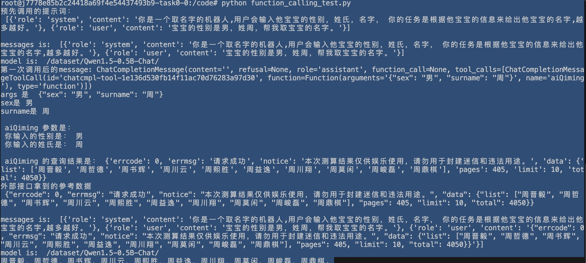


# 理论解释

先休息了，下一步把vLLM的理论部分补上。


