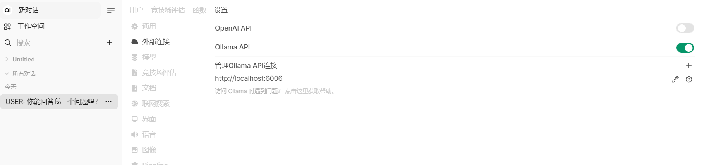
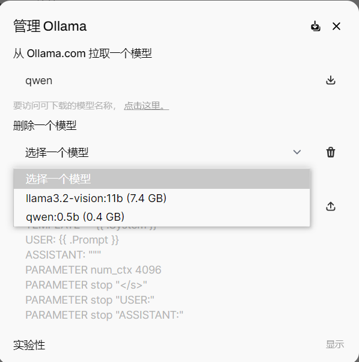
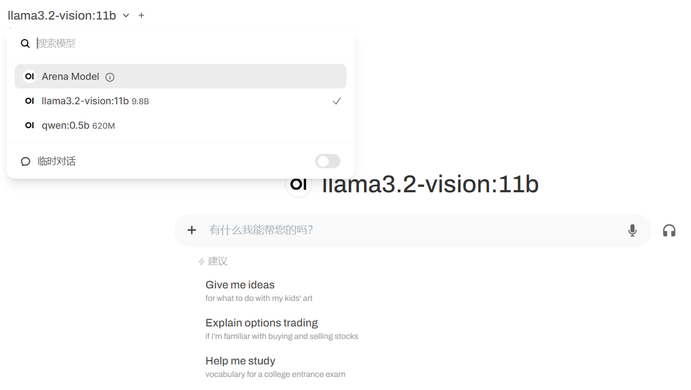

# 新发现

在openai的官网上发现了java和flutter版本的openai sdk，也就意味着，我可以用flutter来构建一套 AI应用，做成PC应用。或者手机App。

在flutter的pub.dev网站上，搜索openai，可以发现一个名叫：`https://pub.dev/packages/dart_openai`的依赖库。

上面展示了很多 openai在dart上的应用方式，代码的写法和逻辑和 python完全类似。

# 本节课内容复现

# 使用openai url 调用vlm的例子

vlm（vision large model）视觉大模型。

视觉大模型，支持输入一个图，附带一个文字prompt，生成文字结果。

gpt4o 示例代码：

```python
import base64
import requests
import os

# OpenAI API Key
api_key = os.environ.get("OPENAI_API_KEY")
base_url = "https://openai.zhixueyouke.cn/v1/chat/completions"


# Function to encode the image
def encode_image(image_path):
    with open(image_path, "rb") as image_file:
        return base64.b64encode(image_file.read()).decode("utf-8")

# Path to your image
current_file_path = os.path.abspath(__file__)
# 获取当前文件所在的目录
current_directory = os.path.dirname(current_file_path)
image_path = os.path.join(current_directory, "images/data.png")

# Getting the base64 string
base64_image = encode_image(image_path)

# print("图片转化后的结果是", base64_image)

headers = {
    "Content-Type": "application/json",
    "Authorization": f"Bearer {api_key}",
}

payload = {
    "model": "gpt-4o-mini",
    "messages": [
        {
            "role": "user",
            "content": [
                {"type": "text", "text": "What’s in this image?"},
                {
                    "type": "image_url",
                    "image_url": {"url": f"data:image/jpeg;base64,{base64_image}"},
                },
            ],
        }
    ],
    "max_tokens": 300,
}

response = requests.post(base_url, headers=headers, json=payload)

print("AI的回答是:",response.json()['choices'][0]['message']['content'])
```

原理很简单，将本地一张图片解析成base64编码字符串，再用post请求的方式发给大模型服务。要求输出结果。

打印结果是：

```bash
AI的回答是: The image appears to be a graph illustrating travel trends in China from 2018 to 2024. The graph includes:

- A bar chart (in light blue) that shows the number of domestic travels (possibly denoted in thousands) for each year between 2018 and 2024.
- A line graph (in red) that likely represents the growth rate or percentage change in domestic travel for the same time period.

The years are labeled along the horizontal axis, while the vertical axis indicates the number of travels and possibly the growth rate. There are fluctuations, particularly around 2020, which might suggest impacts from external factors like the COVID-19 pandemic.
```

# 使用openai sdk 的方式来调用vlm

其实上面的代码可以直接改成sdk的方式重写一次：

```python
import base64
import os
from openai import OpenAI

# OpenAI API Key
api_key = os.environ.get("OPENAI_API_KEY")
client = OpenAI(
    api_key=api_key,
    base_url="https://openai.zhixueyouke.cn/v1",
)


# Function to encode the image
def encode_image(image_path):
    with open(image_path, "rb") as image_file:
        return base64.b64encode(image_file.read()).decode("utf-8")


# Path to your image
current_file_path = os.path.abspath(__file__)
# 获取当前文件所在的目录
current_directory = os.path.dirname(current_file_path)
image_path = os.path.join(current_directory, "images/data.png")

# Getting the base64 string
base64_image = encode_image(image_path)

# print("图片转化后的结果是", base64_image)

response = client.chat.completions.create(
    model="gpt-4o-mini",
    messages=[
        {
            "role": "user",
            "content": [
                {"type": "text", "text": "What’s in this image?"},
                {
                    "type": "image_url",
                    "image_url": {"url": f"data:image/jpeg;base64,{base64_image}"},
                },
            ],
        }
    ],
    max_tokens=300,
)

print("AI的回答是:", response.choices[0].message.content)
```

输出的结果和上面一样，就不重复了。

# 用国产大模型智谱清言glm-4v模型测试

同样，国产大模型也可以用 url的方式以及sdk的方式来测试图片识别能力。

URL的方式：

```python
import base64
import requests
import os

# OpenAI API Key
api_key = "104328b036a52f886e055a58946ddc1c.tPxcvWdqRiorALOu" # 免费送的，有效期2个月，不用也是浪费，就公开了吧。
base_url = "https://open.bigmodel.cn/api/paas/v4/chat/completions"

# Function to encode the image
def encode_image(image_path):
  with open(image_path, "rb") as image_file:
    return base64.b64encode(image_file.read()).decode('utf-8')

# Path to your image
current_file_path = os.path.abspath(__file__)
# 获取当前文件所在的目录
current_directory = os.path.dirname(current_file_path)
image_path = os.path.join(current_directory, "images/dog_and_girl.png")

# Getting the base64 string
base64_image = encode_image(image_path)

headers = {
  "Content-Type": "application/json",
  "Authorization": f"Bearer {api_key}"
}

payload = {
  "model": "glm-4v",
  "messages": [
    {
      "role": "user",
      "content": [
        {
          "type": "text",
          "text": "图里有什么?"
        },
        {
          "type": "image_url",
          "image_url": {
            "url": f"data:image/jpeg;base64,{base64_image}"
          }
        }
      ]
    }
  ],
  "max_tokens": 300
}

response = requests.post(base_url, headers=headers, json=payload)

print("AI的回答是:",response.json()['choices'][0]['message']['content'])
```

# 国产大模型用sdk的方式来调用

```python
from zhipuai import ZhipuAI
import os
import base64

api_key = "104328b036a52f886e055a58946ddc1c.tPxcvWdqRiorALOu"
client = ZhipuAI(api_key=api_key)  # 填写您自己的APIKey

# Path to your image
current_file_path = os.path.abspath(__file__)
# 获取当前文件所在的目录
current_directory = os.path.dirname(current_file_path)
image_path = os.path.join(current_directory, "images/ticket.jpg")


# Function to encode the image
def encode_image(image_path):
    with open(image_path, "rb") as image_file:
        return base64.b64encode(image_file.read()).decode("utf-8")


# Getting the base64 string
base64_image = encode_image(image_path)

response = client.chat.completions.create(
    model="glm-4v",  # 填写需要调用的模型名称
    messages=[
        {
            "role": "user",
            "content": [
                {"type": "text", "text": "图里有什么"},
                {
                    "type": "image_url",
                    "image_url": {
                        "url": f"data:image/jpeg;base64,{base64_image}",
                    },
                },
            ],
        }
    ],
)
print(response.choices[0].message.content)
```

输出结果为：

```bsh
中是一张白底黑字的购物小票，具体信息如下：
- 商店名称：MUJI無印良品
- 购买地点：上海Reel百货
- 单号：2-21052181014-041
- 时间：2018年10月14日14:05:21
- 收银员：306135
- POS机号：21052
- MP ID：0000034292
- 商品信息：
  - 蔓越莓白巧克力：18元/155g，数量1
- 商店名称：MUJI無印良品
- 购买地点：上海Reel百货
- 单号：2-21052181014-041
- 时间：2018年10月14日14:05:21
- 收银员：306135
- POS机号：21052
- MP ID：0000034292
- 商品信息：
  - 蔓越莓白巧克力：18元/155g，数量1
- 时间：2018年10月14日14:05:21
- 收银员：306135
- POS机号：21052
- MP ID：0000034292
- 商品信息：
  - 蔓越莓白巧克力：18元/155g，数量1
- 商品信息：
  - 蔓越莓白巧克力：18元/155g，数量1
  - 蔓越莓白巧克力：18元/155g，数量1
  - 雪球草莓味：原价12元，打折后10元，数量1
- 价格总计：原价30元，促销优惠0元，整单优惠0元，应收金额30元，实收金额30元，找零0元
- 支付方式：支付宝
- 备注：谢谢惠顾！

图片上方有红色水印“此商品无质量问题”。
```

# 同时支持本地图片base64以及网络图片url地址

上面的所有例子都是在用本地图片进行测试，下面我将用url图片地址的方式演示

```python
from zhipuai import ZhipuAI
import os

api_key = "104328b036a52f886e055a58946ddc1c.tPxcvWdqRiorALOu"
client = ZhipuAI(api_key=api_key) # 填写您自己的APIKey

response = client.chat.completions.create(
    model="glm-4v",  # 填写需要调用的模型名称
    messages=[
      {
        "role": "user",
        "content": [
          {
            "type": "text",
            "text": "图里有什么"
          },
          {
            "type": "image_url",
            "image_url": {
                "url" : "https://img1.baidu.com/it/u=1369931113,3388870256&fm=253&app=138&size=w931&n=0&f=JPEG&fmt=auto?sec=1703696400&t=f3028c7a1dca43a080aeb8239f09cc2f"
            }
          }
        ]
      }
    ]
)
print(response.choices[0].message.content)
```

# 作业

用autoDL租一台机器，在上面安装ollama，并且部署vlm类型的模型，然后在ssh隧道映射到本机端口，最后在本机上用fastGPT客户端来测试图片+文本的聊天效果。

vlm模型就选用ollama支持的 llama3.2-vision ，选11b。

## 启动ollama

先启动一个终端，执行

```bash
export OLLAMA_HOST="0.0.0.0:6006"
export OLLAMA_MODELS=/root/autodl-tmp/models
ollama serve
```

然后保持这个终端不动，另起一个终端，执行：

```bash
ollama run llama3.2-vision:11b
```

直到模型下载完成，可以对话为止。

用curl测试一下。

使用一个python程序测试一下：

```python
import ollama

response = ollama.chat(
    model='llama3.2-vision:11b',
    messages=[{
        'role': 'user',
        'content': 'What is in this image?',
        'images': ['bee.jpg']
    }]
)

print(response)
```

```bash
root@autodl-container-b3a44b837c-82697298:~# python llama3.2_vision_test.py 
model='llama3.2-vision:11b' created_at='2024-12-04T06:10:51.402299879Z' done=True done_reason='stop' total_duration=6735976657 load_duration=164520326 prompt_eval_count=18 prompt_eval_duration=2124000000 eval_count=135 eval_duration=2479000000 message=Message(role='assistant', content='In the image, there are several flowers and a bee. The flower has a pink color and appears to be some type of wildflower or garden variety. It has five petals and a yellow center. There are several other flowers in the background that appear to be similar but slightly different colors.\n\nThe bee is black and white with a yellow stripe on its back. It is sitting on the flower, collecting pollen. The bee appears to be a worker bee, which is responsible for gathering nectar and pollen from flowers to feed the colony.\n\nOverall, the image shows a beautiful scene of nature with a busy bee collecting resources for its colony amidst a colorful array of wildflowers.', images=None, tool_calls=None)
```

说明模型运行正常。

## 建立SSH隧道

在我本机打开一个终端，通过ssh隧道连接到远程机器的6006端口。

```bash
ssh -CNg -L 6006:127.0.0.1:6006 root@connect.westc.gpuhub.com -p 13607
```

输入密码连接成功后，打开 http://localhost:6006 访问自定义服务，发现能看到 `Ollama is running`

说明隧道连接成功。

接下来，用 webopenUI 来试一下这个ollama服务。

## 安装并启动 open-webui

首先确保当前的python版本是`3.11`(因为其他版本可能有兼容问题)

执行安装命令
`pip install open-webui`

安装完成后启动服务：
`open-webui serve`

启动完成后，本机浏览器打开：`http://localhost:8080`, 即可看到webOpenUI的界面。

## open-webui 连接到远端的ollama服务

特别注意，如果要在本机部署 open-webui，并且想让他访问到 autoDL机器上的ollama服务的话，必须修改 ollama设置


由于我们在autoDL上是用 6006端口启动的ollama服务，所以上图中的ollama端口就是6006. 当我修改了端口号之后，我就能看到我在autoDL机器上部署的两个模型。


接下来就能开始聊天了。

左上角选择模型：


这里支持上传图片，进行多模态的模型试验。
它可以对图片内容进行信息检索。


试验完成。
